# Exercise Analyser

Check out the doc for architecture and design details.

---

## Cloud Architecture

```mermaid
architecture-beta
  group aws(logos:aws)[AWS]

  group ps(logos:aws-vpc)[Public Subnet] in aws

  service ig(logos:aws-api-gateway)[Internet Gateway] in ps

  group ec2(logos:aws-ec2)[EC2] in ps

  service db(database)[Cassandra] in ec2
  service redis(database)[Redis] in ec2
  service proxy(logos:nginx)[Nginx] in ec2
  service backend(server)[Core] in ec2
  service frontend(server)[Remix] in ec2
  service mq(server)[RabbitMQ] in ec2
  service worker(server)[Async Worker] in ec2

  db:R --> L:backend
  redis:T --> B:backend
  frontend:L <-- R:backend
  frontend:T --> B:proxy
  backend:T <-- B:mq
  worker:R --> L:mq
```

---

## Functional Requirements

1. Through mobile, user can set up camera to capture client performing exercise.
   1. Pose detection should be done in real-time with visual shown on the screen.
2. Detected pose and data should save to the database.
   1. App should be able to retrieve the data and show it to the user.
3. User should be able to see the history of the exercises.
4. Physio-assessment should be saved to the database.