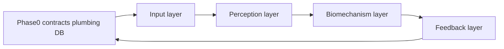

# Plan: async-video-processing

> Single technical specification for implementers: orchestration, layer contracts, phase-0 DB path, and per-layer work. Update this file as the feature evolves.

## 1. Problem and split of responsibilities

**Sapiens / PyTorch / OpenCV** cannot run inside a standard Cloudflare Worker isolate. The app already deploys SvelteKit on Workers with **R2** and uses **MongoDB** for sessions ([`mongo.ts`](../../../app-v2/src/lib/services/mongo.ts)).

- **Edge / app server:** when a set gets a `video_url`, enqueue a job. **Phase 0 (local dev):** HTTP to a **Python API** that **LPUSH**es to **Redis**; a **Docker**-run **worker** **BRPOP**s and writes Mongo. **Later (prod optional):** Cloudflare Queues if the app runs on Workers.
- **Processor (Python):** runs the five conceptual layers (input → perception → biomechanism → feedback → output). **All persistence in v1** goes through **`pymongo`** from Python (`MONGO_URI` in processor env only; never commit secrets).

## 2. High-level dependency order

**Phase 0** proves **queue → Python → Mongo** using a **stub** chart payload and real **`ProcessingResultRepo`** (`MongoSessionSetRepo`). Layers 1–4 replace stub data but keep calling the **same repo** through **`SetProcessingPayload`** DTOs.

## 3. Inter-layer contracts (strategy- and model-agnostic)

**Rule:** Layers talk only via **`typing.Protocol`** and **DTOs** (dataclasses or `TypedDict`). **No vendor types at boundaries** — no `torch.Tensor` crossing boundaries (convert inside adapters). **Orchestrator** (one module) wires concrete adapters from env/config (e.g. `POSE_BACKEND=sapiens`).

**Suggested Python layout**

| Path (illustrative) | Role |
| ------------------- | ---- |
| `ai/pipeline/contracts.py` | Protocols + DTOs |
| `ai/pipeline/adapters/input/`, `…/perception/` | R2, Sapiens |
| `ai/pipeline/repos/` | `MongoSessionSetRepo` (pymongo) |
| `ai/pipeline/orchestrator.py` | Compose deps, run pipeline |

**Boundary table**

| Boundary | Protocol / role | DTOs (names illustrative) | v1 implementation |
| -------- | ---------------- | ------------------------- | ------------------- |
| Input | `FrameSource` | `NormalizedFrame` (`frame_index`, `timestamp_sec`, `numpy` uint8 RGB, optional metadata) | `R2Mp4OpenCVFrameSource`; tests: `ListFrameSource` / local file |
| Perception | `PoseEstimator`, `SegmentationProvider`, `PointmapProvider`, `PerceptionFusion` | `PoseEstimate2d` (keypoints, scores, **layout id**), `PerceptionBundle` | `SapiensPoseAdapter`; null / no-op providers for seg, pointmap, fusion pass-through |
| Biomechanism | `BiomechanicsStrategy` | Chart series / list of points (`frame`, `timestampSec`, `insideKnee`, `outsideHip`, …) | One concrete strategy; registry by `exercise_key` if needed |
| Feedback | `FeedbackStrategy` | `FeedbackOutput` (chart + optional `notes`) | `PassThroughFeedback` |
| Output | `ProcessingResultRepo` | `SetProcessingPayload` (`session_id`, `exercise_id`, `set_id`, `job_id`, chart, `status`, …) | `MongoSessionSetRepo` |

**Testing:** Fake `PoseEstimator` + fake `ProcessingResultRepo` so biomechanics and persistence tests need **no GPU** and optionally **no Mongo**.

## 4. Phase 0 — Job envelope, Redis list, Python worker, output (Mongo)

### 4.1 Job message (JSON)

Single shape in TS producer and Python consumer (proto alignment optional later):

| Field | Type | Notes |
| ----- | ---- | ----- |
| `session_id` | string | Mongo `ObjectId` hex |
| `exercise_id` | string | Mongo `ObjectId` hex |
| `set_id` | string | Mongo `ObjectId` hex |
| `r2_key` | string | Same as `video_url` on the set (e.g. `session/.../video.mp4`) — see [`sign/+server.ts`](../../../app-v2/src/routes/api/media/sign/+server.ts) |
| `job_id` | string | e.g. UUID v7 for logs + idempotency |
| `exercise_key` | string optional | Catalogue key for strategy selection |

### 4.2 App-side: producer (Phase 0 — local)

**Preferred:** After **`updateSetInExercise`** succeeds when **`video_url`** is set on a **`pending`** set ([`sets/[setId]/+server.ts`](../../../app-v2/src/routes/api/sessions/[id]/exercises/[exerciseId]/sets/[setId]/+server.ts)), the same handler **`LPUSH`**es (or **`RPUSH`** — pick one and match the worker’s **`BRPOP`**) a **JSON string** of the job (§4.1) onto a shared Redis list key (e.g. **`video_jobs`**), using **`REDIS_URL`** from server env (`ioredis` / `node-redis` in app-v2).

- **Order:** **Mongo update first**, then **Redis push** so the set is `processing` before the worker runs.
- **Reliability** (document in `log.md`): **best-effort** — log on Redis failure and do not fail the client PUT vs strict error; pick one.

**Optional:** A small **Python HTTP `POST /enqueue`** (or **redis-cli**) remains useful to **inject test jobs** without the app; not required for the main UI path.

**Prod note:** Serverless/edge must reach Redis (URL, TLS, VPC). If that is hard, a later phase can switch to **HTTP to a sidecar** or **Cloudflare Queues** instead of direct `LPUSH` from the Worker.

### 4.3 Phase 0 queue — Redis in Docker (not Wrangler)

- Run **`redis:7`** and a **Python worker** via **`docker-compose`** under [`ai/`](../../../ai/) (or repo root). Worker on start: **loop `BRPOP video_jobs 0`**, parse JSON, run stub **`MongoSessionSetRepo.persist`**.
- App (on host or in another container) uses **`REDIS_URL`** pointing at that Redis (e.g. **`redis://localhost:6379`** with published port).
- **No Wrangler queue** in Phase 0.

### 4.3b Later — Cloudflare Queues (optional)

- When deploying on Workers: add **`queues`** producer + consumer to [`wrangler.jsonc`](../../../app-v2/wrangler.jsonc); consumer may **LPUSH** to Redis or **HTTP** to processor — **deferred** until deployment is standardised on `adapter-cloudflare`.

### 4.4 Python worker (Docker)

- **Worker:** single long-running process: **`BRPOP`** from the list; **Phase 0 stub path:** build `SetProcessingPayload` with **placeholder** `pose_chart_data` (empty list or one row of zeros) and `status: completed`, call **`MongoSessionSetRepo.persist`**. **Idempotent** if nested set `status !== 'processing'` (see §4.5).
- **Optional:** **`POST /enqueue`** on a minimal FastAPI sidecar that only **LPUSH**es (for curl / ops) — same Redis key and JSON shape as the app.

### 4.5 `MongoSessionSetRepo` (pymongo)

- **`MONGO_URI`:** same cluster/database convention as the app; never commit.
- **`update_one`** on **sessions** with **`arrayFilters`** for `exercises._id` and nested `sets._id`, mirroring [`updateSetInExercise`](../../../app-v2/src/lib/services/mongo.ts):  
  `pose_chart_data`, `status`, `exercises.$[ex].sets.$[set].updated_at`, `updated_at` on session root.
- **Chart points** must match **`PoseChartPointSchema`**: `frame`, `timestampSec`, `insideKnee`, `outsideHip`.
- **Idempotency:** e.g. only write if set `status` is `processing`, or match `processing_job_id` if you add that field — **decide and record in `log.md`**.
- **Failure policy:** on pipeline error, leave `processing`, set `notes`, or add `processing_error` — **decide and record in `log.md`**.

### 4.6 Phase 0 verification

- **Docker:** `docker compose up` (redis + worker) → **LPUSH** a test JSON (app PUT, **redis-cli**, or optional HTTP enqueue) → worker consumes → Mongo nested set shows stub `pose_chart_data` and **`status: completed`** (per idempotency rule).
- **UI:** attach video → SvelteKit **PUT** **LPUSH**es → worker → same DB effect.
- Double delivery / retry does not corrupt data per idempotency rule.

## 5. Layer 1 — Input

- **`FrameSource`:** from job `r2_key`, stream **`NormalizedFrame`** with correct **`timestamp_sec`** (container timebase; do not assume CFR if wrong).
- **`R2Mp4OpenCVFrameSource`:** S3-compatible client aligned with [`storage.ts`](../../../app-v2/src/lib/server/storage.ts) (endpoint, region, path-style, bucket, keys from env).
- **Crop ownership:** either **`NormalizedFrame`** is already pose-ready or **`SapiensPoseAdapter`** applies [`pose_topdown_crop_udp`](../../../ai/sapien2_pose_geom.py) internally — **one owner**, no Sapiens types outside perception adapter.
- **Optional:** subsample to max N FPS via config.

## 6. Layer 2 — Perception

- **`PoseEstimator.estimate(frame) -> PoseEstimate2d`**
- **v1:** **`SapiensPoseAdapter`**: load backbone + `PoseHeatmapHead` once; per frame: feature map → heatmaps → [`decode_udp_gaussian_heatmaps`](../../../ai/sapien2_pose_udp.py). Code extracted from [`ai/__main__.py`](../../../ai/__main__.py).
- **Seg / pointmap / fusion:** Protocols implemented as **null** or pass-through; **`PerceptionBundle`** carries optional empty slots for later.
- Sapiens imports only under **`adapters/perception/`** (or equivalent).

## 7. Layer 3 — Biomechanism

- **`BiomechanicsStrategy.compute(perception_stream, job_context) ->` chart series** aligned with **`PoseChartPointSchema`**.
- **Keypoint layout:** encode mapping (indices for knee/hip, etc.) via **`PoseEstimate2d.layout_id`** or strategy config so a future non-Sapiens pose backend can plug in without rewriting the orchestrator.
- Reference client semantics if shared: [`base-pose-engine.ts`](../../../app-v2/src/lib/pose/base-pose-engine.ts).

## 8. Layer 4 — Feedback

- **`FeedbackStrategy`** — v1 **`PassThroughFeedback`**.
- Output **`FeedbackOutput`** → build **`SetProcessingPayload`** → **`ProcessingResultRepo.persist`**.

## 9. Implementation checklist (ordering)

| Order | Deliverable |
| ----- | ----------- |
| 0 | `contracts.py`; **Docker Compose** (**redis** + **Python worker** `BRPOP` loop); app-v2 **`REDIS_URL`** + **`LPUSH`** on set PUT after `video_url`; stub **`MongoSessionSetRepo`** |
| 1 | `FrameSource` + R2/OpenCV adapter |
| 2 | `PoseEstimator` + Sapiens adapter + null seg/PM/fusion |
| 3 | `BiomechanicsStrategy` (v1) |
| 4 | `FeedbackStrategy` + wire real payload to repo |

## 10. Verification (full feature)

- [ ] Phase 0 stub path persists to Mongo via **`pymongo`**.
- [ ] Real pipeline: non-stub `pose_chart_data`, `status: completed`.
- [ ] Idempotent queue behaviour.
- [ ] Unit tests: fake pose + fake repo (no GPU / no Mongo).
- [ ] Bad R2 key / corrupt video → documented failure behaviour.

## 11. Risks

- **Phase 0:** If the app cannot open a TCP connection to Redis (e.g. locked-down serverless), fall back to HTTP enqueue or a managed queue — document when you hit that limit.
- **Later Cloudflare:** queue consumer must only delegate (no ML in Worker); may LPUSH to Redis or call HTTP.
- **Secrets:** rotate anything historical in wrangler; use secrets store for `MONGO_URI` / R2 keys in processor.
- **Schema drift:** `mongo.ts` Zod vs Python — treat TS as spec, update both.
- **Contract drift:** extend DTOs carefully; optional `metadata` maps for experiments.
- Future **multi-head** Sapiens: one backbone forward per frame when seg+pointmap are real.

## 12. Optional later

- SvelteKit **internal HTTP** PATCH wrapping `updateSetInExercise` if you want server-side validation only in TS (not required for v1 with pymongo).

## 13. Doc hygiene

After each shipped slice, append **`changes.md`** and durable decisions **`log.md`**.
