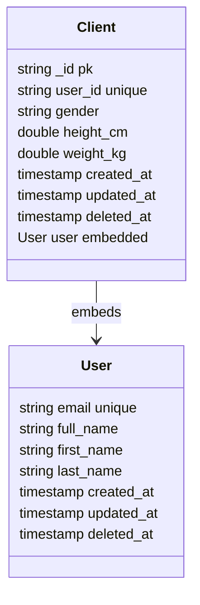

## Value Proposition

> [!NOTE]
> The main question is: What can users get out of using this feature from what they are paying for?

> [!TIP]
> Often related to lowering negative emotion, stress level, perceived difficulty etc.

1. Trainers and builders are often using their eyes, experiences and senses to observe their own form when performing exercises.
2. Very often this leads to a lot of mistakes and injuries.
3. Trainers and builders can use this software to observe their own form and improve their performance, providing better service to their clients.
4. Objective feedback and data are important 

---

## User Journey

> [!NOTE]
> This is a high level overview of the user journey.
>
> Only dealing with trainer here for now. Client and organisation will be added later.

1. When the day starts, the trainer will be chatting up with the client, see how they are doing before the session.
2. When session starts, trainer assigns exercises to the client for the session.
3. Each session is planned in advance with several exercises
   1. Each exercise has a description, type.
   2. Each exercise composes of sets. 
   3. Each sets has a number of repetitions or duration or type of weight and the weight itself.
   4. Some exercises are time-based or repetitions-based.
4. Trainer will be recording the client's form and progress during the session.
5. Between each set, trainer will upload the video of the client's form to the server for analysis, providing feedback and guidance to the client.
6. Once the session is over, trainer will be reviewing the analysis results and providing feedback to the client.
7. Trainer will be able to see the history of the client's exercises and progress.
8. Trainer will be able to compare the client's form and progress over time.


## Requirements

### Functional Requirements

1. Trainer must be able to create a client
   1. Simply email, name, height, weight, gender, date of birth, etc.
2. Trainer must be able to create a session.
   1. A session compose of a date and time, client and exercises
   2. Each exercise has a description, types, time or repetition based
   3. The number of sets should be dynamically created by the trainer based on the exercise and the client's progress.
      1. If trainer decides to increase the number of sets, the trainer should be able to add another row of data
   4. Each set has a number of repetitions or duration or type of weight and the weight itself.
   5. Each set has a video of the client's form.
   6. The form analysis will then process the video in background and provide feedback to the trainer
   7. Once a exercise is created and finished processing the video, it is not editable. only delete

### Non-Functional Requirements

1. The video processing part must be able to run in the background and provide feedback to the trainer.
2. Processing must be fast enough to not delay the trainer's workflow.

---

## Technical Stack

> [!NOTE]
> All about how computer and this software combined together in helping users to obtain those value proposed.

1. Svelte kit for frontend - full stack
   1. Tailwind CSS for styling
   2. Shadcn svelte components
   3. @tanstack/svelte-table for table
   4. @tanstack/svelte-query for data fetching and caching
   5. @tanstack/svelte-form for form handling
   6. RESTful API for backend communication
2. Python for video analysis
3. MongoDB for database
   1. Flexible schema for the video analysis results, session
4. Cloudflare for CDN, R2 for storage, queue for communicating with python worker

---

### Frontend

> [!NOTE]
> Organised by features

### Pages

> [!NOTE]
> All routes are prefixed with `/app` for authenticated routes.
> Public routes: `/`, `/login`, `/register`

#### Public Pages

| Route | Purpose | Key Elements |
|-------|---------|--------------|
| `/` | Landing/marketing page | Feature highlights, pricing, CTA to register |
| `/login` | Trainer authentication | Email/password form, OAuth2 options, link to register |
| `/register` | New trainer signup | Registration form, terms acceptance, redirect to onboarding |

#### Dashboard (`/app/dashboard`)

**Layout**: Sidebar navigation + main content area

**Sections**:
1. **Quick Stats Cards** (top row)
   - Today's sessions count
   - Active clients count
   - Pending video analyses
   - Recent client activity

2. **Today's Schedule** (left column)
   - List of sessions for today
   - Each item: client name, time, status badge
   - Click navigates to `/app/sessions/[id]`

3. **Recent Activity** (right column)
   - Latest completed sessions
   - Recent video analysis completions
   - New client registrations

4. **Quick Actions** (bottom)
   - "New Session" button → `/app/sessions/new`
   - "Add Client" button → `/app/clients/new`

---

#### Client Management

##### Client List (`/app/clients`)

**Layout**: Full-width table with filters

**Elements**:
- Search bar (search by name/email)
- Filter chips: active/inactive, fitness level
- Data table columns: Name, Email, Last Session, Total Sessions, Actions
- "New Client" button (top right)
- Row actions: View, Edit, Delete
- Pagination (20 per page)

**Interactions**:
- Click row → `/app/clients/[id]`
- Click "New Client" → `/app/clients/new`

##### Client Create (`/app/clients/new`)

**Layout**: Centered form card, max-width 600px

**Form Fields**:
- Full name (required)
- Email (required, unique validation)
- Phone (optional)
- Date of birth (date picker)
- Gender (select: male/female/other/prefer not to say)
- Height cm (number input)
- Weight kg (number input)
- Fitness level (select: beginner/intermediate/advanced)
- Injuries/Notes (textarea)
- Fitness goals (multi-select chips)

**Actions**:
- "Create Client" (primary)
- "Cancel" (secondary, back to list)

##### Client Detail (`/app/clients/[id]`)

**Layout**: Two-column on desktop, stacked on mobile

**Left Column (Profile)**:
- Client info card (name, email, phone)
- Physical stats (height, weight, BMI auto-calculated)
- Fitness level badge
- Injuries/notes section
- Edit button → `/app/clients/[id]/edit`

**Right Column (History)**:
- Sessions list (last 10)
- Each session: date, exercise count, completion status
- "View All" link → `/app/sessions?client=[id]`
- Progress chart (exercises over time)

##### Client Edit (`/app/clients/[id]/edit`)

**Layout**: Same as Create

**Pre-filled**: All client data
**Additional**: Archive/Delete actions (danger zone)

---

#### Session Management

##### Session Query (`/app/sessions`)

**Layout**: Filter panel + results table

**Filter Panel** (collapsible on mobile):
- Client selector (searchable dropdown)
- Date range picker (preset: today, this week, this month, custom)
- Status filter (scheduled/in-progress/completed/cancelled)
- Exercise type filter

**Results**:
- Table view (default) with columns: Date, Client, Exercises, Status, Actions
- Card view toggle (mobile-friendly)
- Sort by date (newest first)

**Actions**:
- Click row → `/app/sessions/[id]`
- "New Session" button → `/app/sessions/new`

##### Session Create (`/app/sessions/new`)

**Layout**: Stepper form (3 steps)

**Step 1: Session Info**
- Client selector (required, searchable dropdown)
- Scheduled date/time (datetime picker, default: now)
- Session notes (textarea, optional)

**Step 2: Add Exercises**
- Exercise selector (search from templates)
- For each exercise:
  - Name (auto-filled, editable)
  - Type (strength/cardio/flexibility)
  - Measurement: reps or duration
  - Target reps or target duration
  - Number of sets (default: 3)
  - Rest between sets (seconds)
- "Add Another Exercise" button
- Exercise list with reorder (drag-drop)

**Step 3: Review**
- Summary of all exercises and sets
- "Create Session" button
- Back navigation to edit steps

##### Session Detail (`/app/sessions/[id]`)

**Layout**: Three zones - header, exercise panel, analysis panel

**Header Zone**:
- Client name (link to client detail)
- Session date/time
- Status badge (scheduled/in-progress/completed)
- Timer (if in-progress): elapsed time
- Action buttons: Start/Complete/Edit/Delete

**Exercise Panel** (main content, left 60%):
- Exercise cards in sequence
- Each card:
  - Exercise name + type badge
  - Sets table:
    | Set | Target | Actual | Weight | Video | Status |
    |-----|--------|--------|--------|-------|--------|
    | 1 | 12 reps | _ | _ | [Upload] | pending |
  - "Add Set" button (appears after previous set complete)
  - Set row click → open set recorder drawer

**Set Recorder Drawer** (slides up from bottom):
- Large video capture area (camera access)
- OR file upload dropzone
- Input fields (based on exercise type):
  - Reps completed (number)
  - Duration (if time-based)
  - Weight used (kg)
  - RPE (1-10 slider)
  - Notes (quick text)
- "Save & Upload" button
- Progress indicator during upload

**Analysis Panel** (right 40%, collapsible):
- Real-time status of video processing
- When complete: analysis summary card
  - Overall score (0-100 circular progress)
  - Rep count detected vs actual
  - Key issues found (list)
  - "View Full Analysis" button → `/app/analysis/[id]`
- Previous sets analysis (scrollable list)

**Completion Flow**:
- "Complete Session" button (when all sets done)
- Confirmation modal
- Redirect to session summary view

##### Session Edit (`/app/sessions/[id]/edit`)

**Layout**: Similar to Create, but pre-filled

**Editable if session not started**:
- Client, date/time, notes
- Add/remove exercises
- Modify set counts

**Locked after start**:
- Show message: "Session in progress - cannot modify structure"
- Only notes field editable

**Danger Zone**:
- Cancel session (if scheduled)
- Delete session (if no videos uploaded)

---

#### Analysis View (`/app/analysis/[setId]`)

**Layout**: Full-width video player + analysis sidebar

**Main Area**:
- Video player with:
  - Playback controls
  - Annotation markers on timeline (form issues)
  - Frame-by-frame navigation
  - Slow-motion toggle (0.5x, 0.25x)
- Click marker → jump to timestamp

**Sidebar**:
- Overall score (large display)
- Rep-by-rep breakdown
- Detected issues (grouped by severity)
  - Critical (red): immediate attention
  - Warning (yellow): improvement needed
  - Info (blue): observations
- Recommendations list
- Comparison selector (compare with previous session)

**Actions**:
- "Back to Session" button
- "Share with Client" (generate report)
- Download video with annotations

---

#### User Settings

##### Profile (`/app/profile`)

- Trainer profile info
- Change password
- Connected accounts (OAuth)
- Notification preferences

##### Settings (`/app/settings`)

- App preferences (theme, language)
- Default exercise templates
- Data export
- Account deletion

---

### Components

#### Layout Components

| Component | Purpose |
|-----------|---------|
| `AppShell` | Main layout with sidebar, header, content area |
| `Sidebar` | Navigation links, user profile summary |
| `Header` | Page title, breadcrumbs, action buttons |
| `MobileNav` | Bottom nav for mobile devices |

#### Page-Specific Components

| Component | Used In | Purpose |
|-----------|---------|---------|
| `ClientForm` | ClientCreate, ClientEdit | Reusable client data form |
| `ClientTable` | ClientList | Data table with TanStack Table |
| `ClientCard` | ClientList (mobile) | Card view for mobile |
| `SessionStepper` | SessionCreate | Multi-step form navigation |
| `ExerciseBuilder` | SessionCreate, SessionEdit | Add/configure exercises |
| `SetTable` | SessionDetail | Display and record sets |
| `VideoRecorder` | SessionDetail | Camera capture + upload |
| `AnalysisPanel` | SessionDetail | Real-time analysis status |
| `VideoPlayer` | AnalysisView | Annotated video playback |
| `ScoreDisplay` | AnalysisView, AnalysisPanel | Circular progress score |
| `IssueList` | AnalysisView | Form issues grouped by severity |

#### Shared UI Components

| Component | Purpose |
|-----------|---------|
| `DataTable` | Generic sortable/filterable table |
| `FilterChips` | Active filter display |
| `DateRangePicker` | Date selection with presets |
| `SearchInput` | Debounced search with loading state |
| `EmptyState` | Illustration + message for empty lists |
| `LoadingState` | Skeleton loaders |
| `ConfirmModal` | Destructive action confirmation |
| `Toast` | Success/error notifications |


---

### Backend

> [!NOTE]
> Organised by domain, modularised

### API

#### Client API Endpoints

| Method | Endpoint | Description | Request Body | Response |
|--------|----------|-------------|--------------|----------|
| GET | /api/clients | List all clients | Query: `?search=&limit=20&offset=0` | `{ clients: Client[], total: number }` |
| POST | /api/clients | Create a new client | `{ email, full_name, first_name, last_name, gender, height_cm, weight_kg }` | `Client` |
| GET | /api/clients/[id] | Get client by ID | - | `Client` |
| PUT | /api/clients/[id] | Update client | `{ gender?, height_cm?, weight_kg?, user? }` | `Client` |
| DELETE | /api/clients/[id] | Delete client (soft delete) | - | `{ success: boolean }` |
| GET | /api/clients/[id]/sessions | Get client's sessions | Query: `?from=&to=&status=` | `Session[]` |

### Database

#### Database Schema



### Third Party Services

### DevOps

#### Infrastructure

#### CI/CD Pipeline

#### Monitoring

#### Security

#### Secrets Management

#### Testing

#### Documentation

---

### AI

#### Model / Provider

#### System prompt structure

#### Context Engineering

```

```

## References


## Logs

1. 