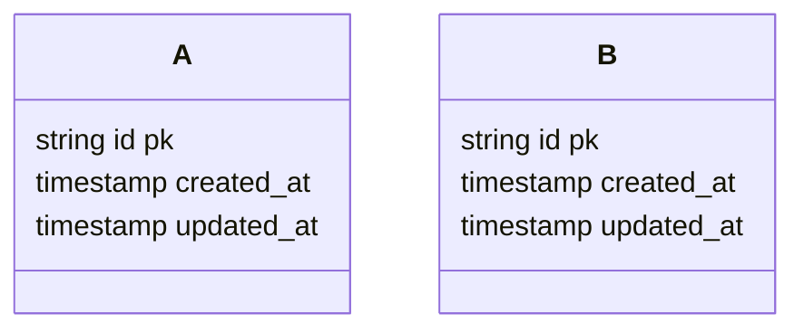

## Value Proposition

> [!NOTE]
> The main question is: What can users get out of using this feature from what they are paying for?

> [!TIP]
> Often related to lowering negative emotion, stress level, perceived difficulty etc.

1. Trainers and builders are often using their eyes, experiences and senses to observe their own form when performing exercises.
2. Very often this leads to a lot of mistakes and injuries.
3. Trainers and builders can use this software to observe their own form and improve their performance, providing better service to their clients.
4. Objective feedback and data are important 

---

## User Journey

> [!NOTE]
> This is a high level overview of the user journey.
>
> Only dealing with trainer here for now. Client and organisation will be added later.

1. When the day starts, the trainer will be chatting up with the client, see how they are doing before the session.
2. When session starts, trainer assigns exercises to the client for the session.
3. Each session is planned in advance with several exercises
   1. Each exercise has a description, type.
   2. Each exercise composes of sets. 
   3. Each sets has a number of repetitions or duration or type of weight and the weight itself.
   4. Some exercises are time-based or repetitions-based.
4. Trainer will be recording the client's form and progress during the session.
5. Between each set, trainer will upload the video of the client's form to the server for analysis, providing feedback and guidance to the client.
6. Once the session is over, trainer will be reviewing the analysis results and providing feedback to the client.
7. Trainer will be able to see the history of the client's exercises and progress.
8. Trainer will be able to compare the client's form and progress over time.


## Requirements

### Functional Requirements

1. Trainer must be able to create a client
   1. Simply email, name, height, weight, gender, date of birth, etc.
2. Trainer must be able to create a session.
   1. A session compose of a date and time, client and exercises
   2. Each exercise has a description, types, time or repetition based
   3. The number of sets should be dynamically created by the trainer based on the exercise and the client's progress.
      1. If trainer decides to increase the number of sets, the trainer should be able to add another row of data
   4. Each set has a number of repetitions or duration or type of weight and the weight itself.
   5. Each set has a video of the client's form.
   6. The form analysis will then process the video in background and provide feedback to the trainer
   7. Once a exercise is created and finished processing the video, it is not editable. only delete

### Non-Functional Requirements

1. The video processing part must be able to run in the background and provide feedback to the trainer.
2. Processing must be fast enough to not delay the trainer's workflow.

---

## Technical Stack

> [!NOTE]
> All about how computer and this software combined together in helping users to obtain those value proposed.

1. Svelte kit for frontend - full stack
   1. Tailwind CSS for styling
   2. Shadcn svelte components
   3. @tanstack/svelte-table for table
   4. @tanstack/svelte-query for data fetching and caching
   5. @tanstack/svelte-form for form handling
   6. RESTful API for backend communication
2. Python for video analysis
3. MongoDB for database
   1. Flexible schema for the video analysis results, session
4. Cloudflare for CDN, R2 for storage, queue for communicating with python worker

---

### Frontend

> [!NOTE]
> Organised by features

### Pages

1. Home page
2. Login page
3. Register page
4. Dashboard page
   1. Dashboard summary
      1. 
   2. Client list
      1. Client detail page
      2. Client edit page
      3. Client create page
   3. Session
      1. Query page
         1. Filter by client, date range, exercise type
      2. Session list page
         1. Table view
         2. On select a row, redirect to session detail page
      3. Session detail page
      4. Session edit page
      5. Session create page
5. User
   1. Profile page
   2. Settings page

### Components

1. AuthProvider


---

### Backend

> [!NOTE]
> Organised by domain, modularised

### Database

#### Database Schema



### Third Party Services

### DevOps

#### Infrastructure

#### CI/CD Pipeline

#### Monitoring

#### Security

#### Secrets Management

#### Testing

#### Documentation

---

### AI

#### Model / Provider

#### System prompt structure

#### Context Engineering

```

```

## References


## Logs

1. 