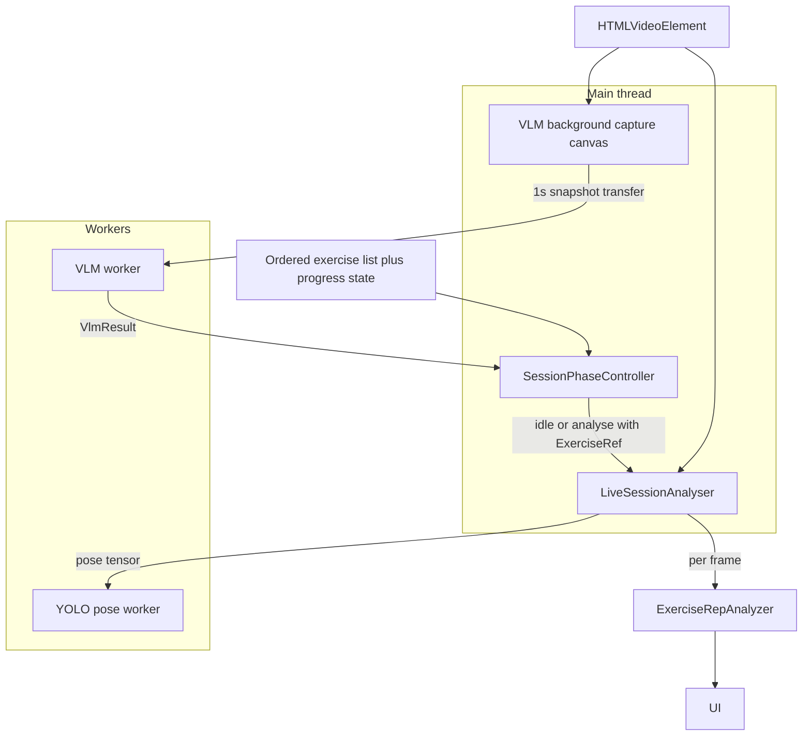
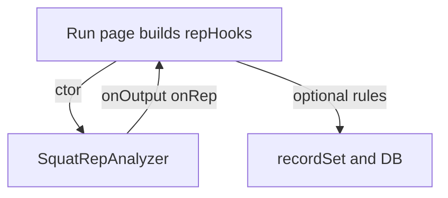
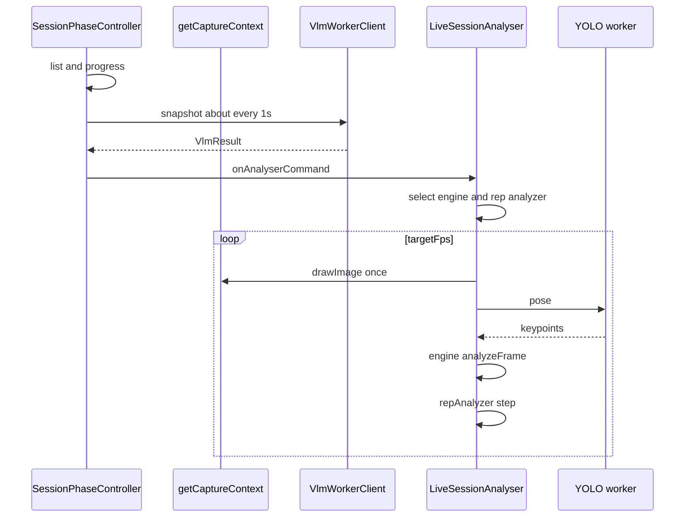
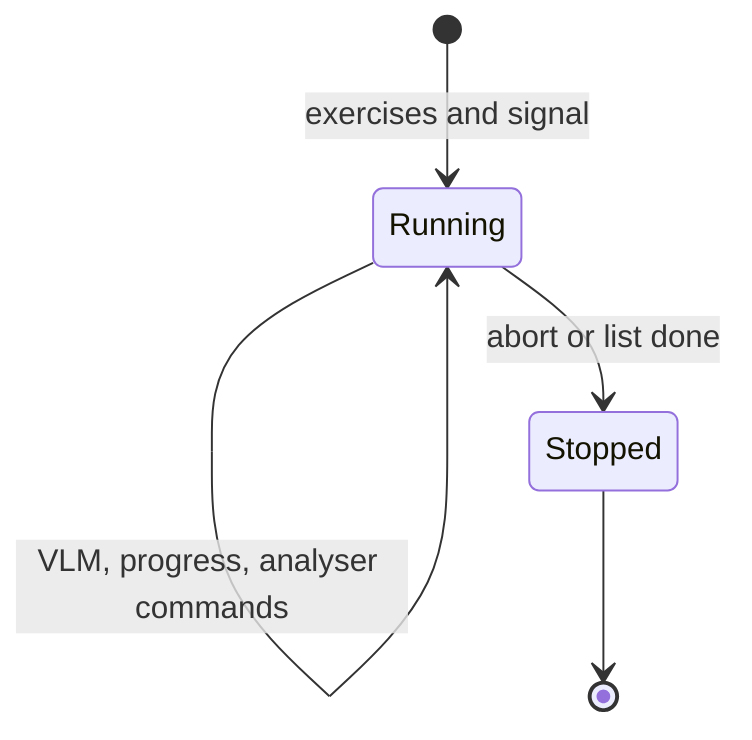

# Design: workout-session-phase-controller

> End-to-end technical design for the session phase layer, live analyser, VLM worker, and exercise rep analyzers. Paths below are relative to the repo root unless noted. A parallel copy may exist in `.cursor/plans/session_phase_controller_23f77fbf.plan.md`; **treat this file as the source of truth in `doc/features`.**

## Context

- [AGENTS.md](../../../AGENTS.md): SvelteKit, Tailwind, `bun`.
- [PRINCIPLES.md](../../../PRINCIPLES.md): feature folder, ADHD-aware UX.
- [ARCHITECTURE.md](../../../ARCHITECTURE.md): project overview; live app under `app-v2/`.

## Current behaviour (baseline)

- [+page.svelte](../../../app-v2/src/routes/app-v2/sessions/%5Bid%5D/run/+page.svelte): live pose at `ANALYSIS_FPS` (5) via [createExercisePoseEngine](../../../app-v2/src/lib/pose/exercise-pose-engine-factory.ts) + `analyzeLiveVideo`. [exercise-vlm-placeholder.ts](../../../app-v2/src/lib/ml/exercise-vlm-placeholder.ts) in-process. [analysis-state-machine.ts](../../../app-v2/src/lib/ml/analysis-state-machine.ts) merges VLM + pose in `tick()` — to be replaced by **`SquatRepAnalyzer`** (VLM **not** in `step`).

- [BasePoseEngine.analyzeLiveVideo](../../../app-v2/src/lib/pose/base-pose-engine.ts) does `ctx.drawImage(video)` per throttled frame; refactor for **single owner** of `drawImage` per frame.

## SessionPhaseController (authoritative responsibilities)

A **session-level orchestrator**. It must **not** import or call any pose engine, `BasePoseEngine`, or YOLO. It only talks to:

- **`VlmWorkerClient`** (and thus `vlm.worker`), and
- **`onAnalyserCommand`** to the live analyser contract.

1. **Input:** ordered **exercise list** (align with session data / `resolveExercisePoseEngineKey`).
2. **Capture:** sample the webcam in the background for VLM using an internal, non-rendered controller canvas at low cadence (~1s). This lets VLM detect the user starting again while pose analysis is idle.
3. **Judge:** on a configurable interval (e.g. 1s), send a canvas snapshot to the **VLM worker**; map to exercising vs resting (and list logic later).
4. **Progress** through the list (v1: hooks + simple cursor; full rules TBD).
5. **Manipulate analyser:** `idle` vs `analyse` + **`ExerciseRef`** so the **type of exercise** is passed down without the controller knowing pose class names.
6. **Lifecycle:** until list done (policy TBD) or **abort** (manual close / navigation).

## Target architecture: main thread + two workers



| Layer | Owns | Must not |
| --- | --- | --- |
| `SessionPhaseController` | `exercises[]`, progress cursor, VLM timing, hidden webcam capture canvas, in-flight, `VlmWorkerClient` only, **analyser commands** | Pose engines, YOLO, `IExerciseRepAnalyzer`, rendered UI |
| `LiveSessionAnalyser` | [createExercisePoseEngine](../../../app-v2/src/lib/pose/exercise-pose-engine-factory.ts) + `createExerciseRepAnalyzer` in `app-v2/src/lib/ml/rep/` (new), shared canvas, rAF loop | VLM, list policy; rep **hooks** come from **rep analyzer constructor** only |
| `IExerciseRepAnalyzer` / `SquatRepAnalyzer` | streaks, rep count, UI phase, **call ctor hooks** from `step` / `reset`; **`readonly engine`** (same ref as live loop) | VLM, exercise list |
| `VlmWorkerClient` | `postMessage` to `vlm.worker`, init, **single-flight**, transferable `ImageBitmap` | — |
| `vlm.worker` | Transformers.js + Gemma (later), `VlmResult` | DOM, Svelte |

**Invariant (performance):** the VLM capture canvas is background-only and not rendered in UI. It draws from the webcam at low cadence (~1s). The analyser draws from the webcam only when `analyse` is active, so pose inference can pause while VLM continues checking whether the user has started exercising again.

## Gating: `userExercising` without coupling

The controller **does not** call `repAnalyzer.step` directly. The page (or a store) holds **`userExercising`** and updates it via **`onUserExercisingChange`** from the controller. **`LiveSessionAnalyser`** receives **`getUserExercising: () => boolean`** so each `step` sees the latest gate without importing VLM.

## Two kinds of “state”

| Layer | Mechanism | Role |
| --- | --- | --- |
| **Lifecycle** | `LiveSessionAnalyser` **`start` / `stop` / `applyCommand`** | rAF, pose, swap **engine + rep analyzer** on `ExerciseRef` change. No FSM **library** for this. |
| **Rep / UI phase (per exercise)** | **`IExerciseRepAnalyzer`** (e.g. `SquatRepAnalyzer`) | **Frame reducer** over `analysis` + `RepGate` — not a product-wide “state machine”. |

## TypeScript: controller + commands

```typescript
type ExerciseRef = {
  id: string;
  orderIndex: number;
  poseKey: "squat" | "push_up" | null;
};

type AnalyserCommand =
  | { kind: "idle" }
  | { kind: "analyse"; exercise: ExerciseRef };

type SessionPhaseControllerConfig = {
  signal: AbortSignal;
  getVideo: () => HTMLVideoElement | null;
  exercises: readonly ExerciseRef[];
  vlm: VlmWorkerClient;
  vlmIntervalMs: number;
  getSessionInProgress: () => boolean;
  onAnalyserCommand: (cmd: AnalyserCommand) => void;
  getCaptureContext: () => CanvasRenderingContext2D | null;
  mapVlmToUserExercising: (r: VlmResult) => boolean;
  onUserExercisingChange?: (exercising: boolean) => void;
  onVlmResult?: (r: VlmResult) => void;
  onProgress?: (p: { currentIndex: number; done: boolean }) => void;
};
```

**VLM worker messages (sketch):**  
`main → worker` `{ type: "init" }` | `{ type: "run", id, /* ImageBitmap */ }` | `{ type: "dispose" }`  
`worker → main` `{ type: "ready" }` | `{ type: "result", id, vlm: VlmResult }` | `{ type: "error" }`

## TypeScript: exercise rep analyzer (extensible)

```typescript
export type RepPhase = "idle" | "exercising" | "rep_peak" | "rest";

export type ExerciseRepAnalyzerHooks<TOut> = {
  onOutput: (o: TOut) => void;
  onRep?: (p: { count: number; atMs: number }) => void;
  onPhaseChange?: (prev: RepPhase, next: RepPhase) => void;
  onError?: (e: Error) => void;
};

export type RepGate = {
  nowMs: number;
  sessionInProgress: boolean;
  userExercising: boolean;
};

export interface IExerciseRepAnalyzer {
  readonly engine: BasePoseEngine<unknown, unknown>;
  reset(): void;
  step(input: RepGate & { analysis: unknown | null }): void;
}

export class SquatRepAnalyzer implements IExerciseRepAnalyzer {
  constructor(
    private readonly hooks: ExerciseRepAnalyzerHooks<SquatRepOutput>,
    readonly engine: SquatPoseEngine,
  ) {}
  // step(input: RepGate & { analysis: SquatFrameAnalysis | null }): void
}

export function createExerciseRepAnalyzer(
  key: PoseEngineExerciseKey,
  engine: ReturnType<typeof createExercisePoseEngine>,
  hooks: ExerciseRepAnalyzerHooks<unknown>,
): IExerciseRepAnalyzer { /* switch key; v1: squat */ }
```

**Mermaid: constructor hooks to page and optional DB policy**



## TypeScript: LiveSessionAnalyser config

```typescript
export type LiveSessionAnalyserConfig = {
  getVideo: () => HTMLVideoElement | null;
  poseRuntime: ReturnType<typeof createPoseEngineRuntime>;
  modelInputSize: number;
  targetFps: number;
  getSessionInProgress: () => boolean;
  getUserExercising: () => boolean;
  orchestrationHooks?: { onAnalysisFrame?: ...; onError?: (e: Error) => void };
  signal: AbortSignal;
  createRepHooks: (exercise: ExerciseRef | null) => ExerciseRepAnalyzerHooks<SquatRepOutput>;
};

export interface LiveSessionAnalyser {
  applyCommand(cmd: AnalyserCommand): void;
  start(): void;
  stop(): void;
  resetForExerciseChange(): void;
}
```

**`step` input to rep analyzer:** `sessionInProgress` and `userExercising` from getters; `analysis` from `engine` — **no** `vlm` in `step`.

**DB / set completion:** not inside `SquatRepAnalyzer`; page composes `onOutput` / `onRep` / session rules (debounce, target reps, etc.).

## Per-component map

| Unit | Proposed file | Emits to |
| --- | --- | --- |
| `SessionPhaseController` | `app-v2/src/lib/ml/session-phase-controller.ts` | `onAnalyserCommand`, `onProgress`, `onUserExercisingChange?` |
| `VlmWorkerClient` | `app-v2/src/lib/ml/vlm-worker-client.ts` | promises / callbacks to controller |
| `vlm.worker` | `app-v2/src/lib/workers/vlm.worker.ts` | `VlmResult` |
| `LiveSessionAnalyser` | `app-v2/src/lib/ml/live-session-analyser.ts` | orchestration hooks only; rep via rep analyzer |
| `SquatRepAnalyzer` | `app-v2/src/lib/ml/rep/*` | `onOutput`, `onRep`, … (ctor) |
| `+page.svelte` | [+page.svelte](../../../app-v2/src/routes/app-v2/sessions/%5Bid%5D/run/+page.svelte) | UI, mutations |

## Sequence: controller vs analyser (no pose in controller)



## State diagram: list-driven session loop



## BasePoseEngine live refactor

Add **`processLiveFrameAfterDraw`** (or equivalent) so **`LiveSessionAnalyser`** is the only place that **`drawImage(video)`** per throttled frame, or a shared **LiveFrameSource** both the analyser and the VLM snapshot use. See [base-pose-engine.ts](../../../app-v2/src/lib/pose/base-pose-engine.ts) (current `analyzeLiveVideo` ~91–118).

## VLM (client, worker)

- **No server route** in v1. Placeholder in worker until Transformers.js + model weights. **`@huggingface/transformers`** and Vite worker bundling TBD.
- **Unknown label policy (required):** e.g. do **not** change `userExercising` when `label === "unknown"` — document the chosen rule in [requirements.md](./requirements.md).

## Run page integration (checklist)

1. Build `ExerciseRef[]` from `session.exercises` (sort `order_index`); set `poseKey` via `resolveExercisePoseEngineKey`.
2. `userExercising` in `$state`; wire `onUserExercisingChange` from the phase controller; pass `getUserExercising` into `LiveSessionAnalyser`.
3. `onAnalyserCommand` → `liveSessionAnalyser.applyCommand`.
4. On `analyse`: [createExercisePoseEngine](../../../app-v2/src/lib/pose/exercise-pose-engine-factory.ts) + `createExerciseRepAnalyzer` with `createRepHooks(exercise)`.
5. `idle` in v1: **stop** the pose rAF loop (saves work).
6. On exercise change: `resetForExerciseChange()` and `repAnalyzer.reset()`.
7. Teardown: `abort`, reset gating, dispose VLM worker, `analyser.stop()`.

## Out of scope (v1)

- Full auto-advance through the list from VLM alone; hysteresis on VLM; auto `completeSession` when the list ends (hooks only).
- `recordSet` on every VLM “rest” without product debounce and rules.

## Related files

- [requirements.md](./requirements.md) — acceptance checklist.
- [plan.md](./plan.md) — short execution steps.
- [log.md](./log.md) — decisions.
- [changes.md](./changes.md) — shipped deltas.
