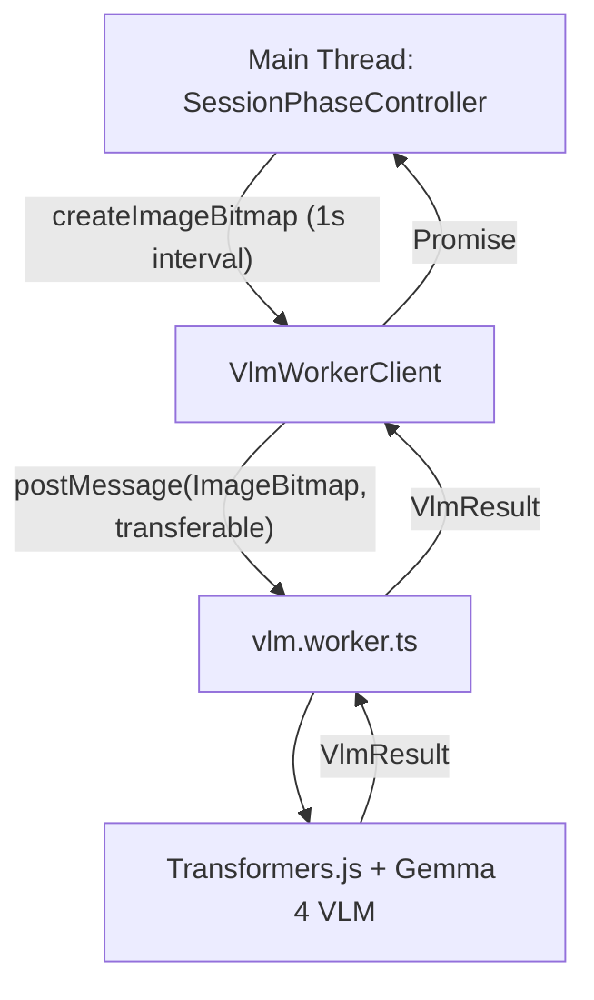

# VLM Implementation Plan

> **Status:** Draft plan for implementing VLM (Vision Language Model), VLM worker, and client class  
> **Feature:** workout-session-phase-controller  
> **Branch:** `new/exercise-phase-controller`

## Context

This plan covers **Phase 1** of the [workout-session-phase-controller](./plan.md) feature: implementing the VLM Web Worker and client class for exercise classification.

**Related docs:**
- [design.md](./design.md) — Full technical design and architecture
- [plan.md](./plan.md) — Phased implementation checklist
- [requirements.md](./requirements.md) — Requirements and acceptance criteria

## Overview

Implement a **client-side VLM** that runs in a Web Worker to classify exercise activity from video frames. The VLM will use **Transformers.js** with the **Gemma 4 Vision Language Model** (`onnx-community/gemma-4-E2B-it-ONNX`) to determine if the user is exercising, resting, or in an unknown state.

## Architecture



## Components

### 1. VlmWorkerClient (`app-v2/src/lib/ml/vlm-worker-client.ts`)

**Responsibilities:**
- Manage lifecycle: `init()`, `dispose()`
- Send frames to worker with `run(ImageBitmap)`
- Handle single-flight inference (drop or coalesce if inference in progress)
- Request ID management for async responses
- Type-safe message passing

**Interface:**

```typescript
export type VlmResult = {
  label: "unknown" | "squat" | "not_exercising";
  confidence: number;
  stateHint?: string;
  raw?: unknown;
};

export class VlmWorkerClient {
  constructor();
  
  /**
   * Initialize the worker and load the model.
   * Resolves when the worker is ready.
   */
  init(): Promise<void>;
  
  /**
   * Run inference on a video frame.
   * Uses transferable ImageBitmap for performance.
   * Single-flight: ignores new requests if inference in progress.
   * 
   * @param bitmap - ImageBitmap to analyze (will be transferred)
   * @returns VlmResult or null if dropped
   */
  run(bitmap: ImageBitmap): Promise<VlmResult | null>;
  
  /**
   * Dispose the worker and free resources.
   */
  dispose(): Promise<void>;
  
  /**
   * Check if the worker is ready for inference.
   */
  get isReady(): boolean;
  
  /**
   * Check if inference is currently in progress.
   */
  get isInferring(): boolean;
}
```

**Message Types (client → worker):**

```typescript
type InitMessage = {
  type: "init";
};

type RunMessage = {
  type: "run";
  id: number;
  bitmap: ImageBitmap;
};

type DisposeMessage = {
  type: "dispose";
};

type WorkerInputMessage = InitMessage | RunMessage | DisposeMessage;
```

**Message Types (worker → client):**

```typescript
type ReadyMessage = {
  type: "ready";
};

type ResultMessage = {
  type: "result";
  id: number;
  vlm: VlmResult;
};

type ErrorMessage = {
  type: "error";
  id?: number;
  message: string;
};

type WorkerOutputMessage = ReadyMessage | ResultMessage | ErrorMessage;
```

**Implementation notes:**
- Use `new Worker(new URL("../workers/vlm.worker.ts", import.meta.url), { type: "module" })` for Vite
- Maintain request counter for unique IDs
- Track pending request ID for single-flight enforcement
- Use `Promise` + resolver map pattern for async responses
- Transfer `ImageBitmap` ownership to worker (zero-copy)

### 2. VLM Worker (`app-v2/src/lib/workers/vlm.worker.ts`)

**Responsibilities:**
- Load Transformers.js and Gemma 4 VLM model
- Process `ImageBitmap` frames
- Return `VlmResult` with exercise classification
- Report loading progress
- Handle errors gracefully

**Implementation Strategy:**

#### Phase 1A: Placeholder (for immediate testing)

```typescript
// Placeholder: returns fixed result for testing
workerScope.onmessage = async (event: MessageEvent<WorkerInputMessage>) => {
  const message = event.data;
  
  if (message.type === "init") {
    // Simulate loading delay
    await new Promise(resolve => setTimeout(resolve, 100));
    workerScope.postMessage({ type: "ready" });
    return;
  }
  
  if (message.type === "run") {
    // Placeholder: return unknown
    workerScope.postMessage({
      type: "result",
      id: message.id,
      vlm: {
        label: "unknown",
        confidence: 0.0,
      },
    });
    return;
  }
  
  if (message.type === "dispose") {
    // Cleanup placeholder state
    return;
  }
};
```

#### Phase 1B: Gemma 4 VLM Integration

Based on the code in `exercise-vlm-placeholder.ts`:

```typescript
import {
  Gemma4ForConditionalGeneration,
  AutoProcessor,
  type PreTrainedModel,
  type Processor,
  RawImage,
} from "@huggingface/transformers";

const MODEL_ID = "onnx-community/gemma-4-E2B-it-ONNX";

let processor: Processor | null = null;
let model: PreTrainedModel | null = null;
let isReady = false;

async function loadModel(): Promise<void> {
  if (isReady) return;
  
  const [loadedProcessor, loadedModel] = await Promise.all([
    AutoProcessor.from_pretrained(MODEL_ID),
    Gemma4ForConditionalGeneration.from_pretrained(MODEL_ID, {
      dtype: "q4f16",
      device: "webgpu",
      progress_callback: (info) => {
        if (info.status === "progress" && info.progress) {
          const progress = Math.round(info.progress);
          if (progress % 10 === 0) {
            console.log(`[VLM Worker] Loading model: ${progress}%`);
          }
        }
      },
    }),
  ]);
  
  processor = loadedProcessor;
  model = loadedModel;
  isReady = true;
}

async function inferFrame(bitmap: ImageBitmap): Promise<VlmResult> {
  if (!processor || !model) {
    throw new Error("VLM model not initialized");
  }
  
  // Convert ImageBitmap to format Transformers.js expects
  const image = await RawImage.fromBlob(await bitmap.convertToBlob());
  
  // Create prompt for exercise classification
  const messages = [
    {
      role: "user",
      content: [
        { type: "image", image },
        { 
          type: "text", 
          text: "Is this person performing a squat exercise? Answer: exercising, not_exercising, or unknown."
        }
      ]
    }
  ];
  
  // Apply chat template and process
  const inputs = await processor(messages);
  
  // Generate response
  const output = await model.generate({
    ...inputs,
    max_new_tokens: 32,
    do_sample: false,
  });
  
  // Decode output
  const decodedOutput = processor.decode(output[0], { 
    skip_special_tokens: true 
  });
  
  // Parse response into VlmResult
  return parseVlmResponse(decodedOutput);
}

function parseVlmResponse(text: string): VlmResult {
  const lower = text.toLowerCase();
  
  // Simple keyword matching
  if (lower.includes("exercising") && !lower.includes("not")) {
    return { label: "squat", confidence: 0.8 };
  }
  if (lower.includes("not_exercising") || lower.includes("not exercising")) {
    return { label: "not_exercising", confidence: 0.8 };
  }
  
  return { label: "unknown", confidence: 0.0 };
}

workerScope.onmessage = async (event: MessageEvent<WorkerInputMessage>) => {
  const message = event.data;
  
  try {
    if (message.type === "init") {
      await loadModel();
      workerScope.postMessage({ type: "ready" });
      return;
    }
    
    if (message.type === "run") {
      const vlm = await inferFrame(message.bitmap);
      workerScope.postMessage({
        type: "result",
        id: message.id,
        vlm,
      });
      return;
    }
    
    if (message.type === "dispose") {
      processor = null;
      model = null;
      isReady = false;
      return;
    }
  } catch (error) {
    const payload: ErrorMessage = {
      type: "error",
      message: error instanceof Error ? error.message : "VLM worker failed",
    };
    
    if (message.type === "run") {
      workerScope.postMessage({ ...payload, id: message.id });
      return;
    }
    
    workerScope.postMessage(payload);
  }
};
```

### 3. VLM Result Type

Already defined in `exercise-vlm-placeholder.ts`:

```typescript
export type VlmResult = {
  label: "unknown" | "squat" | "not_exercising";
  confidence: number;
  stateHint?: string;
  raw?: unknown;
};
```

**Unknown Label Policy:**  
When `label === "unknown"`, the `SessionPhaseController` should **not** change `userExercising` state. This prevents spurious state changes from low-confidence or ambiguous frames.

## Implementation Steps

### Step 1: Create VLM Worker (Placeholder)

**File:** `app-v2/src/lib/workers/vlm.worker.ts`

- [ ] Set up worker boilerplate (similar to `yolo.worker.ts`)
- [ ] Define message types
- [ ] Implement placeholder responses
- [ ] Test worker creation and message passing

**Verification:**
- Worker file builds without errors
- Can instantiate worker in browser
- `postMessage` communication works

### Step 2: Create VLM Worker Client

**File:** `app-v2/src/lib/ml/vlm-worker-client.ts`

- [ ] Implement `VlmWorkerClient` class
- [ ] Add `init()`, `run()`, `dispose()` methods
- [ ] Implement single-flight logic
- [ ] Add request ID management
- [ ] Handle worker messages with Promise resolvers

**Verification:**
- TypeScript compiles without errors
- `bun run check` passes
- Client can init, run, and dispose worker

### Step 3: Integration Test

**File:** Create test route or dev utility

- [ ] Create simple test page/script
- [ ] Load test image or video frame
- [ ] Call `client.init()`
- [ ] Call `client.run(bitmap)`
- [ ] Verify placeholder result returned
- [ ] Test single-flight: rapid calls drop extras
- [ ] Test cleanup: `dispose()` terminates worker

**Verification:**
- [ ] Placeholder `VlmResult` received in main thread
- [ ] No uncaught errors in console
- [ ] Worker thread shows in DevTools (separate from main)
- [ ] Single-flight logic works (log dropped requests)

### Step 4: Integrate Gemma 4 VLM Model

**File:** `app-v2/src/lib/workers/vlm.worker.ts`

- [ ] Add `@huggingface/transformers` dependency
- [ ] Implement model loading with progress callback
- [ ] Implement `inferFrame()` with Gemma 4
- [ ] Add response parsing logic
- [ ] Handle WebGPU device selection
- [ ] Add error handling for model failures

**Verification:**
- [ ] Model loads in worker (check DevTools console)
- [ ] Progress callbacks fire during load
- [ ] Inference returns classification
- [ ] No DOM API errors in worker
- [ ] Vite builds worker chunk correctly

### Step 5: Vite Configuration (if needed)

**File:** `app-v2/vite.config.ts`

If Transformers.js bundling fails:

```typescript
export default defineConfig({
  // ... existing config
  optimizeDeps: {
    exclude: ["@huggingface/transformers"],
  },
  worker: {
    format: "es",
  },
});
```

### Step 6: Performance Testing

- [ ] Test with real video frames (1s interval)
- [ ] Measure inference latency
- [ ] Verify transferable ImageBitmap (no serialization)
- [ ] Check memory usage (no leaks)
- [ ] Verify main thread not blocked during inference

## Dependencies

### New Package Dependencies

```json
{
  "dependencies": {
    "@huggingface/transformers": "^3.0.0"
  }
}
```

Install with:

```bash
cd app-v2
bun add @huggingface/transformers
```

### Existing Dependencies (no changes needed)

- `onnxruntime-web` (already used for YOLO)
- Worker support in Vite (already configured)

## Technical Considerations

### 1. Model Size and Loading

- Gemma 4 E2B with quantization (`q4f16`) is ~2-3GB
- First load will be slow (~30s-2min depending on network)
- Model cached in browser after first load
- Show loading progress to user

### 2. WebGPU vs WASM

- Prefer WebGPU for performance
- Fall back to WASM if WebGPU unavailable
- Test on multiple browsers/devices

### 3. Single-Flight Strategy

**Options:**

A. **Drop new requests** (simple, recommended for v1)
   - If inference in progress, return `null` immediately
   - Controller handles dropped frames gracefully

B. **Queue latest** (more complex)
   - Keep only most recent request
   - Process queued request after current completes

**Recommendation:** Use option A for simplicity. At 1s intervals, single-flight rarely triggers.

### 4. Error Handling

- Model load failures → disable VLM, fall back to always "unknown"
- Inference errors → return "unknown" for that frame
- Worker crashes → recreate worker, reinit model
- Timeout → treat as "unknown" (add 5s timeout per inference)

### 5. Transferable ImageBitmap

```typescript
// Correct usage:
const bitmap = await createImageBitmap(canvas);
await client.run(bitmap); // bitmap transferred, can't reuse

// Incorrect:
const bitmap = await createImageBitmap(canvas);
await client.run(bitmap);
await client.run(bitmap); // ERROR: bitmap already transferred
```

Always create fresh bitmap for each call.

## Testing Strategy

### Unit Tests (optional for v1)

- Mock worker with fixtures
- Test single-flight logic
- Test request ID management
- Test error handling

### Integration Tests

1. **Worker communication**
   - Init/ready handshake
   - Run with placeholder data
   - Dispose cleanup

2. **Model loading**
   - Progress callbacks fire
   - Ready message after load
   - Model cached on reload

3. **Inference**
   - Returns valid `VlmResult`
   - Classifications make sense
   - Confidence values reasonable

4. **Error cases**
   - Invalid ImageBitmap
   - Worker crash recovery
   - Model load failure

### Manual Testing Checklist

- [ ] Load page, VLM worker starts
- [ ] Model loads with progress indicator
- [ ] Camera feed → bitmap → worker → result
- [ ] Results logged in console (1s intervals)
- [ ] Main thread responsive during inference
- [ ] DevTools: worker thread shows separately
- [ ] Navigate away: worker terminated
- [ ] Reload page: model cached, loads faster

## Migration Path

### Phase 1A: Placeholder (current)

- Worker returns fixed `unknown` result
- Client and message infrastructure in place
- Can wire into `SessionPhaseController`

### Phase 1B: Real Model

- Replace placeholder with Gemma 4
- No API changes to `VlmWorkerClient`
- Drop-in upgrade

### Future: Improved Model

- Swap `MODEL_ID` constant
- Update prompt if needed
- Update `parseVlmResponse()` logic
- No changes to client interface

## Performance Targets

| Metric | Target | Notes |
|--------|--------|-------|
| Model load time | < 60s | First load, cached thereafter |
| Inference latency | < 500ms | Per frame, WebGPU |
| Inference latency | < 2s | Per frame, WASM fallback |
| Memory overhead | < 4GB | Model + runtime |
| Main thread impact | 0ms | All work in worker |

## Risks and Mitigations

| Risk | Likelihood | Impact | Mitigation |
|------|------------|--------|------------|
| Model too large for browser | Medium | High | Test on low-end devices, provide fallback |
| WebGPU not supported | Low | Medium | WASM fallback |
| Inference too slow | Medium | Medium | Use quantized model, adjust interval |
| Vite bundling issues | Medium | High | Use external CDN for model weights |
| Worker memory leaks | Low | High | Proper cleanup, dispose pattern |

## References

### Internal Docs

- [design.md](./design.md) — Architecture
- [plan.md](./plan.md) — Phased implementation
- [requirements.md](./requirements.md) — Acceptance criteria
- [exercise-vlm-placeholder.ts](../../../app-v2/src/lib/ml/exercise-vlm-placeholder.ts) — Gemma 4 code examples

### External Resources

- [Transformers.js Docs](https://huggingface.co/docs/transformers.js)
- [Gemma 4 Model](https://huggingface.co/onnx-community/gemma-4-E2B-it-ONNX)
- [Web Workers MDN](https://developer.mozilla.org/en-US/docs/Web/API/Web_Workers_API)
- [ImageBitmap MDN](https://developer.mozilla.org/en-US/docs/Web/API/ImageBitmap)
- [Transferable Objects](https://developer.mozilla.org/en-US/docs/Web/API/Web_Workers_API/Transferable_objects)

## Success Criteria

Phase 1 is complete when:

- [ ] `VlmWorkerClient` class exists and compiles
- [ ] `vlm.worker.ts` exists and builds
- [ ] Worker returns `VlmResult` (placeholder or real)
- [ ] Single-flight logic works
- [ ] `bun run check` passes
- [ ] Manual test: bitmap → worker → result
- [ ] DevTools: inference on worker thread
- [ ] Ready for integration in `SessionPhaseController`

## Next Steps

After Phase 1 completion:

1. **Phase 2:** Implement `SquatRepAnalyzer` and retire `AnalysisStateMachine`
2. **Phase 3:** Refactor `BasePoseEngine` for single `drawImage`
3. **Phase 4:** Implement `LiveSessionAnalyser`
4. **Phase 5:** Implement `SessionPhaseController` (uses `VlmWorkerClient`)
5. **Phase 6:** Run page integration

See [plan.md](./plan.md) for full phase breakdown.

---

**Document Status:** Draft for review  
**Author:** Cursor Agent  
**Date:** 2026-04-24  
**Branch:** `new/exercise-phase-controller`
