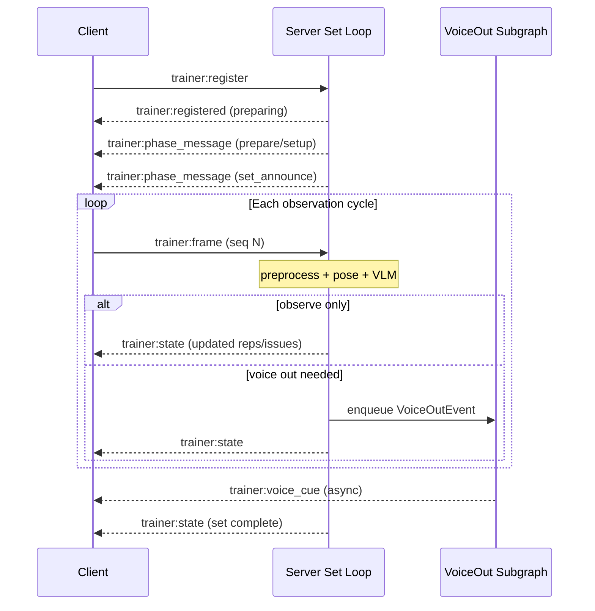

# Contract: Trainer WebSocket (`/trainer`)

**Feature**: `001-ai-trainer-agent` | **Transport**: Socket.IO namespace `/trainer`

**Scope**: WebSocket connection is scoped to **one Coached Exercise Run** (one exercise block). A multi-exercise Gymbo Session uses a new register/start cycle per exercise after camera reposition.

## Connection

```
URL: {BACKEND_WS_URL}/trainer
Auth: Session cookie or Bearer token (same as existing Gymbo auth)
```

Client connects after REST `POST /api/trainer/exercise-runs/{run_id}/start` returns `ws_token` (optional short-lived token for WS auth).

---

## Client → Server Events

### `trainer:register`

Register a live coaching stream for one exercise run.

```json
{
  "run_id": "uuid",
  "gymbo_session_id": "uuid",
  "session_exercise_id": "uuid",
  "client_id": "uuid",
  "exercise_type": "overhead_squat",
  "camera_view": "LEFT",
  "config": {
    "frame_sample_rate_fps": 1.0
  }
}
```

**Response event**: `trainer:registered`

```json
{
  "run_id": "uuid",
  "session_exercise_id": "uuid",
  "status": "preparing",
  "config": { "...": "ExerciseRunConfig" }
}
```

**Errors**: `trainer:error` with `{ "code": "RUN_NOT_FOUND" | "UNAUTHORIZED" | "ALREADY_ACTIVE" }`

---

### `trainer:frame`

Send a sampled camera frame.

```json
{
  "meta": {
    "run_id": "uuid",
    "seq": 42,
    "timestamp_sec": 12.5,
    "dimensions": { "width": 1280, "height": 720, "format": "jpeg" }
  },
  "frame": "<base64 JPEG or binary attachment>"
}
```

**Server behavior**:
- Append to frame buffer (ring, latest wins)
- Does NOT block waiting for VLM; set loop polls buffer independently

**Errors**: `trainer:error` `{ "code": "BUFFER_FULL" | "RUN_NOT_ACTIVE" }` — client should drop frame and continue

---

### `trainer:control`

Trainer actions during an exercise run.

```json
{
  "run_id": "uuid",
  "action": "resume" | "end" | "end_set" | "end_rest" | "emergency_ack"
}
```

| Action | When | Effect |
|--------|------|--------|
| `resume` | Run `paused` after emergency | Resume coaching for this exercise |
| `end` | Any time | End this exercise run → per-exercise feedback; trainer may start next exercise |
| `end_set` | Set in progress | Complete set with current rep count |
| `end_rest` | Rest in progress | Skip remaining rest timer |
| `emergency_ack` | After emergency event | Acknowledge safety message (UI only) |

**Response**: `trainer:state` with updated session snapshot

---

### `trainer:unregister`

Clean disconnect.

```json
{ "run_id": "uuid" }
```

---

## Server → Client Events

### `trainer:state`

Session phase and observation snapshot (sent on transitions and periodically).

```json
{
  "run_id": "uuid",
  "status": "active",
  "phase": "set_in_progress",
  "current_set": {
    "set_number": 2,
    "target_reps": 10,
    "completed_reps": 4
  },
  "merged_state": {
    "rep_phase": "descending",
    "in_rep": true,
    "active_issues": ["forward lean"]
  },
  "timestamp": "2026-06-20T12:00:00Z"
}
```

---

### `trainer:voice_cue`

Spoken coaching cue from VoiceOut subgraph.

```json
{
  "cue_id": "uuid",
  "run_id": "uuid",
  "message": "Drive your knees out and keep chest up.",
  "focus_issue": "knee valgus",
  "severity": "moderate",
  "set_number": 2,
  "trigger": "new_issue" | "repeat_threshold",
  "repeat_count": 3,
  "timestamp": "2026-06-20T12:00:01Z"
}
```

**Client behavior**: Enqueue for playback. If `is_playing`, append to queue (FR-032). Never interrupt current cue.

---

### `trainer:phase_message`

Non-voice guidance (prepare, setup, set announce, rest, feedback, complete).

```json
{
  "run_id": "uuid",
  "phase": "prepare" | "setup" | "set_announce" | "rest" | "feedback" | "session_complete",
  "message": "Get your barbell racked and camera framed from the left side.",
  "metadata": {
    "set_number": 1,
    "target_reps": 10
  }
}
```

---

### `trainer:emergency`

Safety halt.

```json
{
  "run_id": "uuid",
  "source": "set_check" | "global_monitor",
  "severity": "critical",
  "description": "Possible loss of balance detected",
  "action_required": "pause",
  "timestamp": "2026-06-20T12:00:02Z"
}
```

**Client behavior**: Stop frame loop send optional; display alert; enable resume/end controls.

---

### `trainer:error`

```json
{
  "code": "string",
  "message": "human readable",
  "run_id": "uuid?"
}
```

---

## Sequence: Live Set Observation



---

## Backpressure

| Condition | Server action | Client action |
|-----------|---------------|---------------|
| Frame buffer full | Drop oldest; accept latest | Continue sending at configured rate |
| Voice queue > 20 events | Coalesce by focus_issue; drop oldest | No action |
| VLM timeout (>5s) | Skip cycle; log | Continue sending frames |
| Session paused | Ignore frames except heartbeat | Pause frame loop |

---

## Heartbeat

Client emits `trainer:ping` every 15s with `{ "run_id": "uuid" }`.
Server responds `trainer:pong` with `{ "status": "..." }`.
Missed pong × 3 → server marks session `paused`; client shows reconnect UI.
