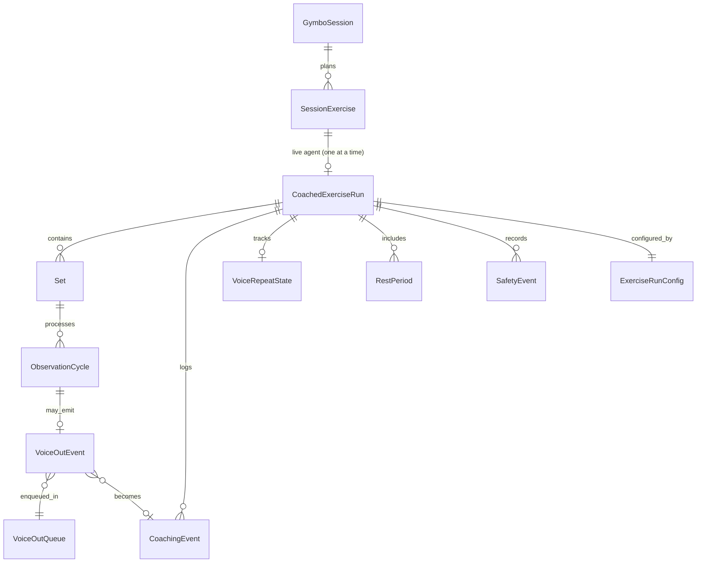
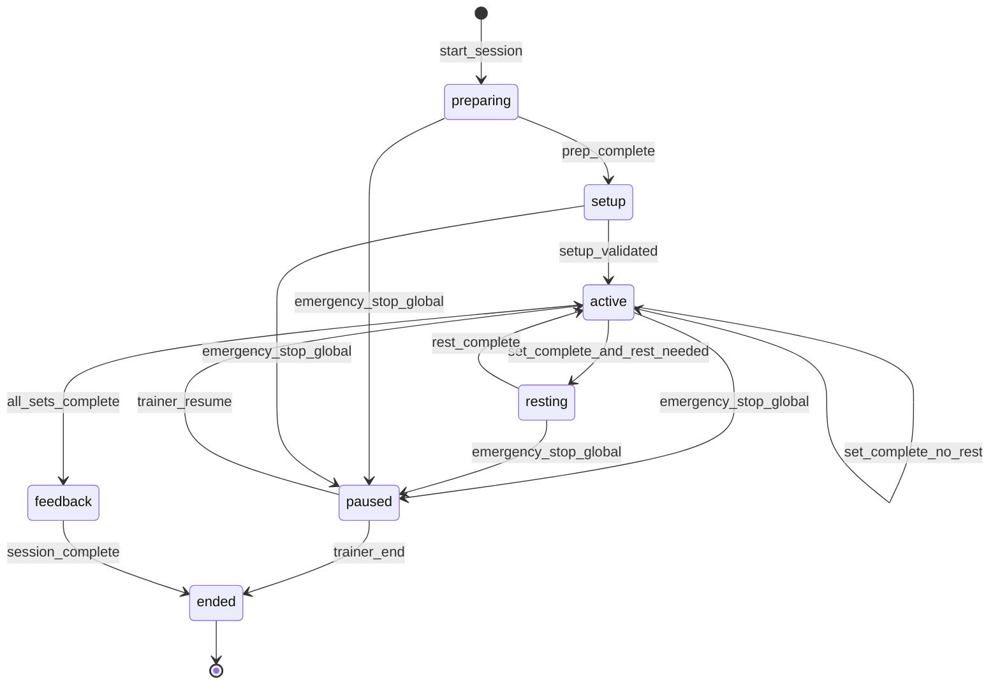

# Data Model: AI Live Trainer Agent

**Feature**: `001-ai-trainer-agent` | **Date**: 2026-06-20

## Overview

Entities support the hybrid client/server live coaching flow. Server owns agent state; client owns frame sampling and voice playback queue. MongoDB persists session lifecycle; ephemeral runtime state (frame buffer, voice-out queue, dedup state) lives in-memory per **Coached Exercise Run** within the single trainer worker process.

A **Gymbo Session** may contain multiple planned exercises. The agent graph processes **one exercise at a time**—each run linked to a `SessionExercise` with its own sets, reps, and rest config.

### Terminology

| Term | Description |
|------|-------------|
| **Gymbo Session** | Existing `Session` entity; multi-exercise workout plan |
| **SessionExercise** | One row in `Session.exercises[]`; planned sets/reps/rest for that movement |
| **Coached Exercise Run** | One live agent graph invocation for one `SessionExercise` |
| **Session Graph** | LangGraph orchestrator scoped to a single Coached Exercise Run |

---

## Gymbo Session (existing)

Trainer-facing workout container. Not replaced by the agent— the live trainer attaches to it.

| Field | Source | Notes |
|-------|--------|-------|
| `id` | `Session.id` | Parent for all exercise runs |
| `exercises[]` | `SessionExercise[]` | Pre-planned blocks; each may have different sets/reps |
| `status` | `scheduled` / `in-progress` / `completed` | Session-level lifecycle |
| `client_id`, `trainer_id` | existing | Unchanged |

**Multi-exercise UX**: Trainer completes Coached Exercise Runs in plan order (or chosen order). Gymbo Session completes when all exercises are done or trainer ends early.

---

## SessionExercise (existing, plan input)

One planned exercise block. Config for a Coached Exercise Run is derived from this row.

| Field | Maps to ExerciseRunConfig |
|-------|---------------------------|
| `id` | `session_exercise_id` |
| `exercise_key` | `exercise_type` (e.g. `overhead_squat`) |
| `target_sets` | `planned_sets` |
| `target_reps` | `target_reps_per_set` |
| `rest_seconds` | `rest_duration_sec` |
| `name`, `notes` | Display + prep prompts |

---

## CoachedExerciseRun

Primary aggregate for **one live exercise block**. The LangGraph Session Graph orchestrates a single Coached Exercise Run from prepare through per-exercise feedback.

*(Spec refers to this scope as "coached session" for one exercise—this document uses Coached Exercise Run to distinguish from the multi-exercise Gymbo Session.)*

| Field | Type | Required | Description |
|-------|------|----------|-------------|
| `id` | string (UUID) | yes | Run identifier |
| `gymbo_session_id` | string | yes | Parent Gymbo Session |
| `session_exercise_id` | string | yes | Which planned exercise block |
| `trainer_id` | string | yes | Authenticated trainer user |
| `client_id` | string | yes | Athlete being coached |
| `exercise_type` | enum | yes | v1: `overhead_squat` (from `exercise_key`) |
| `status` | enum | yes | See state machine below |
| `config` | ExerciseRunConfig | yes | Sets, reps, rest, thresholds (from SessionExercise + overrides) |
| `merged_observation_state` | object | yes | VLM-merged state for this exercise only |
| `current_set_number` | int | yes | 1-based index |
| `completed_sets` | int | yes | Sets finished in this run |
| `voice_repeat_state` | VoiceRepeatState | yes | Dedup tracking (resets each run) |
| `started_at` | datetime | no | Run start |
| `ended_at` | datetime | no | Run end |
| `exercise_feedback` | string | no | Per-exercise feedback at run close |
| `created_at` | datetime | yes | Record creation |
| `updated_at` | datetime | yes | Last mutation |

### Status State Machine

| Status | Description |
|--------|-------------|
| `preparing` | Client/equipment preparation guidance |
| `setup` | Initial setup validation before first set |
| `active` | Set observation loop running or between sets |
| `resting` | Rest subgraph active |
| `paused` | Global emergency stop; awaiting trainer action |
| `feedback` | Per-exercise feedback generation |
| `ended` | Exercise run complete; trainer may start next exercise |

**Validation rules**:
- `current_set_number` ≤ `config.planned_sets` while active
- `ended_at` required when `status = ended`
- `merged_observation_state.completed_reps` monotonically non-decreasing within a set

---

## ExerciseRunConfig

Config for one Coached Exercise Run—typically seeded from `SessionExercise`, overridable before the run starts.

| Field | Type | Default | Description |
|-------|------|---------|-------------|
| `planned_sets` | int | 3 | Number of sets |
| `target_reps_per_set` | int | 10 | Target reps per set |
| `rest_duration_sec` | int | 60 | Rest between sets |
| `rest_needed` | bool | true | Whether to invoke rest subgraph |
| `frame_sample_rate_fps` | float | 1.0 | Client sampling rate |
| `voice_repeat_threshold` | int | 3 | Similar events before speaking |
| `exercise_type` | string | `overhead_squat` | From `SessionExercise.exercise_key` |

**Validation rules**:
- `planned_sets` ≥ 1
- `target_reps_per_set` ≥ 1
- `rest_duration_sec` ≥ 0
- `frame_sample_rate_fps` ∈ (0, 5]
- `voice_repeat_threshold` ≥ 1

---

## ClientFrameLoop

Client-side runtime (not persisted; documented for contract alignment).

| Field | Type | Description |
|-------|------|-------------|
| `run_id` | string | Active Coached Exercise Run id |
| `sample_rate_fps` | float | Current sampling rate |
| `last_sent_seq` | int | Last frame sequence sent |
| `is_running` | bool | Loop active |

**Behavior**: Samples camera at `sample_rate_fps`, encodes JPEG, sends via WebSocket during an active Coached Exercise Run. Stops when run ends; trainer starts a new run (new connection or re-register) for the next exercise.

---

## FrameBuffer

Server-side per-session ephemeral store.

| Field | Type | Description |
|-------|------|-------------|
| `run_id` | string | Owner Coached Exercise Run |
| `frames` | ring buffer | Latest N JPEG frames (default N=3) |
| `latest_seq` | int | Highest received sequence |
| `last_received_at` | datetime | For stall detection |

**Behavior**: On each observation cycle, set subgraph reads `frames[-1]`. Empty buffer → skip cycle, log warning, no voice-out from stale data.

---

## Set

One round of reps within a session.

| Field | Type | Description |
|-------|------|-------------|
| `set_number` | int | 1-based |
| `target_reps` | int | From config |
| `completed_reps` | int | From merged observation state |
| `status` | enum | `in_progress`, `complete`, `emergency_stopped` |
| `started_at` | datetime | Set start |
| `completed_at` | datetime | Set end |

**State transitions**:
- `in_progress` → `complete` when `completed_reps >= target_reps` (from VLM state)
- `in_progress` → `emergency_stopped` on unsafe safety check
- Trainer may end set early → `complete` with actual `completed_reps`

---

## ObservationCycle

Single grab-preprocess-analyze-merge-or-emit pass.

| Field | Type | Description |
|-------|------|-------------|
| `cycle_id` | string | Unique per cycle |
| `set_number` | int | Parent set |
| `frame_seq` | int | Source frame sequence |
| `frame_timestamp_sec` | float | Client timestamp |
| `pose_landmarks` | object | MediaPipe output (nullable) |
| `pose_confidence` | float | 0–1 |
| `vlm_result` | VLMFrameResult | Structured VLM output |
| `form_judgment` | enum | `observe`, `voice_out` |
| `safety_outcome` | enum | `safe`, `unsafe` |
| `processed_at` | datetime | Server processing time |

---

## VLMFrameResult

Structured output from vision analysis (extends POC model).

| Field | Type | Description |
|-------|------|-------------|
| `frame_index` | int | Frame reference |
| `timestamp_sec` | float | Timestamp |
| `in_rep` | bool | Athlete actively performing rep |
| `rep_phase` | enum | setup, descending, bottom, ascending, lockout, rest |
| `observations` | string[] | Neutral observations |
| `issues` | string[] | Form issues detected |
| `severity` | enum | none, minor, moderate, critical |
| `confidence` | float | 0–1 |
| `rep_completed` | bool | Rep finished this frame |
| `action` | enum | observe, voice_out |
| `voice_reason` | string? | Why voice-out needed |
| `focus_issue` | string? | Primary coaching target |

**Validation rules**:
- `voice_out` action requires `focus_issue` and `voice_reason` when `confidence >= 0.5`
- `rep_completed` increments merged `completed_reps` in session state
- `severity: critical` triggers safety check failure

---

## MergedObservationState

Accumulated VLM state for rep tracking (FR-022).

| Field | Type | Description |
|-------|------|-------------|
| `completed_reps` | int | Reps completed in current set |
| `total_session_reps` | int | Across all sets |
| `rep_phase` | string | Current phase |
| `in_rep` | bool | Active rep |
| `active_issues` | string[] | Current form issues |
| `frame_results` | VLMFrameResult[] | Rolling history (bounded) |
| `recurring_issues` | map | issue → count for feedback |

---

## VoiceOutEvent

Fire-and-forget coaching trigger from set loop.

| Field | Type | Description |
|-------|------|-------------|
| `event_id` | string | UUID |
| `run_id` | string | Parent Coached Exercise Run |
| `set_number` | int | Source set |
| `focus_issue` | string | Issue key for dedup |
| `reason` | string | VLM voice_reason |
| `severity` | enum | Issue severity |
| `timestamp` | datetime | Emission time |
| `frame_seq` | int | Source frame |

**Queue behavior**: `put_nowait` onto session-scoped `asyncio.Queue`. Set loop does not await consumption. Queue is created when session starts and discarded when session ends. Bounded with `maxsize` (default 20); on full, coalesce or drop oldest events per backpressure rules in `contracts/trainer-ws.md`.

---

## VoiceRepeatState

Deduplication state for voice subgraph.

| Field | Type | Description |
|-------|------|-------------|
| `last_voiced_issue` | string? | Last spoken focus issue |
| `repeat_count` | int | Consecutive similar events since last speak |
| `threshold` | int | From ExerciseRunConfig (default 3) |

**Similarity rule**: Issues match if normalized `focus_issue` strings are equal (case-insensitive, trimmed). Future: embedding similarity—out of v1 scope.

**Transitions**:
- New issue → generate cue, speak, reset `repeat_count` to 0, set `last_voiced_issue`
- Similar + count < threshold → increment count, drop event
- Similar + count >= threshold → generate fresh cue, speak, reset count

---

## VoicePlaybackQueue

Client-side queue (not server-persisted).

| Field | Type | Description |
|-------|------|-------------|
| `items` | VoiceCue[] | Pending cues |
| `is_playing` | bool | Current playback active |
| `current_cue_id` | string? | Playing cue |

**Behavior**: Server sends `voice_cue` events. Client enqueues unless server marked `skipped`. Plays sequentially via Web Speech API without interrupting current cue.

---

## CoachingEvent

Logged spoken output.

| Field | Type | Description |
|-------|------|-------------|
| `id` | string | UUID |
| `run_id` | string | Parent Coached Exercise Run |
| `message` | string | Spoken cue text |
| `focus_issue` | string | Issue addressed |
| `trigger_reason` | string | VLM reason |
| `severity` | enum | At time of speak |
| `set_number` | int | Set context |
| `timestamp` | datetime | When spoken |
| `dedup_repeat_count` | int? | Repeat count if threshold-triggered |

---

## RestPeriod

Break between sets.

| Field | Type | Description |
|-------|------|-------------|
| `set_number_after` | int | Set just completed |
| `duration_sec` | int | Configured rest duration |
| `started_at` | datetime | Timer start |
| `ends_at` | datetime | Expected end |
| `status` | enum | `in_progress`, `complete`, `skipped` |
| `activities_delivered` | string[] | During-rest messages sent |

**Transitions**:
- `in_progress` → `complete` when timer elapses
- `in_progress` → `skipped` when trainer ends rest early

---

## SafetyEvent

Safety trigger record.

| Field | Type | Description |
|-------|------|-------------|
| `id` | string | UUID |
| `run_id` | string | Parent Coached Exercise Run |
| `source` | enum | `set_check`, `global_monitor` |
| `severity` | enum | moderate, critical |
| `description` | string | What triggered |
| `halted_session` | bool | Whether coaching halted |
| `timestamp` | datetime | Detection time |

**Rules**:
- Set-level + unsafe → set emergency, return to session graph
- Global → session status `paused`, all subgraphs interrupted

---

## In-Memory Session Runtime (server process)

Per active Coached Exercise Run, held in the trainer worker's run registry:

| Field | Type | Purpose |
|-------|------|---------|
| `voice_out_queue` | `asyncio.Queue[VoiceOutEvent]` | Async handoff from set loop to VoiceOut consumer |
| `frame_buffer` | ring buffer (latest N JPEG frames) | Latest-frame observation input |
| `voice_repeat_state` | VoiceRepeatState | Hot-path dedup state |
| `voice_consumer_task` | `asyncio.Task` | Background VoiceOut drain loop |

**Lifecycle**: Created when a Coached Exercise Run starts (`trainer:register` for that `session_exercise_id`); torn down when run ends or disconnects. Next exercise in the Gymbo Session starts a fresh run with new runtime state.

**Future migration**: If Set and VoiceOut split across processes, replace `voice_out_queue` with Redis list `voice_out:{run_id}` without changing event schema.

---

## MongoDB Collections

| Collection | Document | Notes |
|------------|----------|-------|
| `coached_exercise_runs` | CoachedExerciseRun | One row per live exercise block |
| `coaching_events` | CoachingEvent | Append-only log; tagged with `session_exercise_id` |
| `safety_events` | SafetyEvent | Audit trail per run |

Indexes:
- `coached_exercise_runs`: `{ gymbo_session_id: 1, session_exercise_id: 1 }`
- `coached_exercise_runs`: `{ trainer_id: 1, created_at: -1 }`
- `coaching_events`: `{ run_id: 1, timestamp: 1 }`
