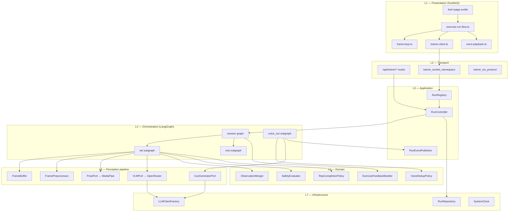
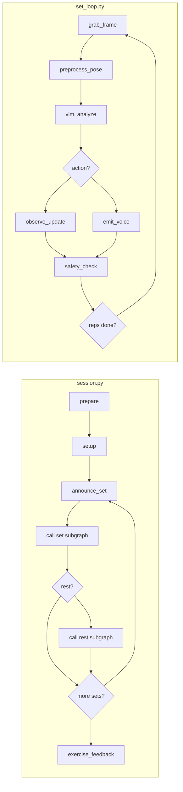

# Modular Architecture: AI Live Trainer Agent

**Feature**: `001-ai-trainer-agent` | **Date**: 2026-06-20

## Design goals

| Goal | How modules support it |
|------|------------------------|
| **Incremental delivery** | P1–P7 phases map to independent module groups |
| **Testability** | Domain + pipeline modules testable without LangGraph or Socket.IO |
| **DRY** | POC logic from `langchain-flow.py` extracted once into pipeline/domain |
| **Swapability** | Pose and VLM behind ports; exercise prompts behind registry |
| **Single responsibility** | Graph nodes orchestrate; they do not embed business rules |

## Layer model



### Dependency rules

```
L1 → L2 only (via HTTP/WS contracts)
L2 → L3 only (no direct graph imports in transport)
L3 → L4, L5, L6, L7
L4 → L5, L6 (nodes call domain + pipeline; no Mongo/WS in nodes)
L5 → nothing above L5 (pure logic + Pydantic models)
L6 → L7 ports only (LLM, clock)
L7 → external libs (Mongo, OpenRouter)
```

**Forbidden**: LangGraph nodes importing Socket.IO; domain importing LangGraph; frontend importing backend Python.

---

## Module catalog

### Frontend (`app/src/lib/trainer/`)

| Module | File(s) | Responsibility | Depends on |
|--------|---------|----------------|------------|
| **exercise-run-flow** | `exercise-run-flow.ts` | Multi-exercise UX: pick next `SessionExercise`, start/end runs, track completed blocks within Gymbo Session | `api/sessions`, `trainer-client` |
| **frame-loop** | `frame-loop.ts` | Camera capture, configurable fps sampler, JPEG encode, pause on run end | browser MediaStream API |
| **trainer-client** | `trainer-client.ts` | Socket.IO `/trainer` client: register, send frames, receive state/cues/emergency | `contracts/trainer-ws` types |
| **voice-playback** | `voice-playback.ts` | Client-side cue queue, Web Speech API, no-interrupt policy | events from `trainer-client` |
| **live-state** | `live-state.svelte.ts` | Runes/store for active run UI: reps, phase, issues, connection status | `trainer-client`, `voice-playback` |

**Public surface**: `startExerciseRun()`, `stopExerciseRun()`, `sendTrainerControl(action)`.

**Not in scope**: LangGraph, rep logic, VLM—client is transport + playback only.

---

### Transport (backend boundary)

| Module | File(s) | Responsibility | Depends on |
|--------|---------|----------------|------------|
| **trainer_ws_protocol** | `models/trainer_ws_protocol.py` | Pydantic wire shapes for all WS events | — |
| **trainer_socket_namespace** | `trainer_socket_namespace.py` | Socket.IO handlers: register, frame, control, ping | `RunRegistry`, protocol models |
| **trainer_rest (SvelteKit)** | `app/src/routes/api/trainer/**`, `app/src/lib/server/trainer-runs.ts`, `app/src/lib/server/trainer-worker.ts` | Public REST: run CRUD, config, event logs; proxies graph lifecycle to Python | MongoDB, `trainer-worker` |
| **trainer_internal_api (Python)** | `backend/src/trainer_api.py` | Internal HTTP: `POST /internal/runs/{id}/start|resume|end|pause` → `RunController` | `RunController`, `RunRegistry` |

Transport validates wire format, delegates to application layer, publishes events back to client. **No coaching logic here.**

---

### Application (`backend/src/agent/app/`)

| Module | File(s) | Responsibility | Depends on |
|--------|---------|----------------|------------|
| **RunRegistry** | `app/run_registry.py` | In-memory map `run_id → RunContext` (frame buffer, voice queue, graph task, dedup state) | domain models |
| **RunController** | `app/run_controller.py` | Lifecycle: create run from `SessionExercise`, start graph, pause/resume/end, teardown | `RunRegistry`, graph factory, `RunRepository` |
| **RunEventPublisher** | `app/event_publisher.py` | Push `trainer:state`, `trainer:voice_cue`, `trainer:emergency` to connected socket | Socket.IO sid from registry |
| **RunContext** | `app/run_context.py` | Per-run bag: config, queues, frame buffer ref, voice consumer task handle | L5/L6 instances |

**RunContext** is the composition root for one Coached Exercise Run—all subgraphs receive a shared context or state slice, not globals.

---

### Orchestration — LangGraph (`backend/src/agent/graphs/`)

Graphs **wire nodes and conditional edges only**. Node bodies delegate to L5/L6.

| Module | File | Nodes | Calls into |
|--------|------|-------|------------|
| **session** | `graphs/session.py` | `prepare`, `setup`, `announce_set`, `decide_rest`, `decide_more_sets`, `exercise_feedback` | domain feedback builder, invokes set/rest subgraphs |
| **set_loop** | `graphs/set_loop.py` | `grab_frame`, `preprocess_pose`, `vlm_analyze`, `observe_update`, `emit_voice`, `safety_check`, `check_reps_complete` | pipeline + domain |
| **voice_out** | `graphs/voice_out.py` | `consume_event`, `dedup_check`, `generate_cue`, `log_coaching` | `VoiceDedupPolicy`, `CueGeneratorPort`, repository |
| **rest** | `graphs/rest.py` | `start_timer`, `during_rest_tick`, `check_timer_done` | `SystemClock`, event publisher |



**Graph factory** (`graphs/factory.py`): `build_session_graph(run_context) → CompiledGraph` wires dependencies for dry-run vs live.

---

### Domain (`backend/src/agent/domain/`)

Pure functions and policies—**no I/O, no LangGraph imports**.

| Module | File | Responsibility |
|--------|------|----------------|
| **models** | `domain/models.py` | `VLMFrameResult`, `MergedObservationState`, `VoiceOutEvent`, `ExerciseRunConfig` |
| **observation_merger** | `domain/observation_merger.py` | Merge VLM result into state; increment reps on `rep_completed` (FR-022) |
| **rep_completion** | `domain/rep_completion.py` | `is_set_complete(completed_reps, target)` |
| **voice_dedup** | `domain/voice_dedup.py` | `evaluate(event, repeat_state, threshold) → speak \| skip \| increment` |
| **safety_evaluator** | `domain/safety_evaluator.py` | Set-level unsafe from VLM severity; global monitor hook |
| **exercise_feedback** | `domain/exercise_feedback.py` | Aggregate issues/coaching events into per-exercise summary input |

Extract from POC: `merge_states()` → `observation_merger.py`; routing thresholds → `voice_dedup.py`.

---

### Perception pipeline (`backend/src/agent/pipeline/`)

| Module | File | Responsibility | Port |
|--------|------|----------------|------|
| **frame_buffer** | `pipeline/frame_buffer.py` | Ring buffer; `push(frame)`, `latest() → Frame \| None` | — |
| **preprocessor** | `pipeline/preprocessor.py` | JPEG decode, resize, normalize for pose/VLM | — |
| **pose** | `pipeline/pose/` | `PosePort` protocol; `MediapipePoseAdapter` wraps `estimator/mediapipe.py` | `PosePort` |
| **vlm** | `pipeline/vlm/` | `VLMPort` protocol; `OpenRouterVLMAdapter` wraps POC `invoke_structured_vlm` | `VLMPort` |
| **cue_generator** | `pipeline/cue_generator.py` | `CueGeneratorPort`; short coaching cue from focus issue + context | `CueGeneratorPort` |
| **frame_history** | `pipeline/frame_history.py` | Rolling N-frame context for VLM (from POC `FRAME_HISTORY_LIMIT`) | — |

**Ports** (protocols in `pipeline/ports.py`):

```python
class PosePort(Protocol):
    def estimate(self, frame: np.ndarray) -> PoseResult | None: ...

class VLMPort(Protocol):
    def analyze(self, *, frames: Sequence[FrameSnapshot], context: VLMContext) -> VLMFrameResult: ...

class CueGeneratorPort(Protocol):
    def generate(self, *, event: VoiceOutEvent, state: MergedObservationState) -> str: ...
```

Dry-run adapters return fixtures from `tmp/vlm-state/processed/` for integration tests.

---

### Exercise plugins (`backend/src/agent/exercises/`)

| Module | File | Responsibility |
|--------|------|----------------|
| **registry** | `exercises/registry.py` | `get_profile(exercise_key) → ExerciseProfile` |
| **overhead_squat** | `exercises/overhead_squat.py` | VLM system prompt, issue taxonomy, prep/setup copy |

v1 registers one profile. Adding a new exercise = new profile file + registry entry—**no graph changes**.

---

### Infrastructure (`backend/src/agent/infra/`)

| Module | File | Responsibility |
|--------|------|----------------|
| **run_repository** | `infra/run_repository.py` | Mongo CRUD for `CoachedExerciseRun`, coaching events |
| **llm_factory** | `infra/llm_factory.py` | OpenRouter client from env; shared by VLM + cue + feedback |
| **clock** | `infra/clock.py` | `now()`, `sleep(sec)` for rest timer (testable fake) |

---

## Decomposition map: spec subgraphs → modules

| Spec subgraph | Orchestration | Domain | Pipeline | App |
|---------------|---------------|--------|----------|-----|
| **Session Graph** | `graphs/session.py` | `exercise_feedback` | — | `RunController` |
| **Set Subgraph** | `graphs/set_loop.py` | merger, rep_completion, safety | frame_buffer, pose, vlm | `RunContext.frame_buffer` |
| **VoiceOut Subgraph** | `graphs/voice_out.py` | voice_dedup | cue_generator | `RunContext.voice_queue` + consumer task |
| **Rest Subgraph** | `graphs/rest.py` | — | — | `event_publisher`, `clock` |
| **Global safety** | interrupt in `RunController` | `safety_evaluator` | — | pauses all tasks in `RunContext` |

---

## File tree (target)

```text
backend/src/agent/
├── app/
│   ├── run_context.py
│   ├── run_controller.py
│   ├── run_registry.py
│   └── event_publisher.py
├── domain/
│   ├── models.py
│   ├── observation_merger.py
│   ├── rep_completion.py
│   ├── voice_dedup.py
│   ├── safety_evaluator.py
│   └── exercise_feedback.py
├── pipeline/
│   ├── ports.py
│   ├── frame_buffer.py
│   ├── preprocessor.py
│   ├── frame_history.py
│   ├── cue_generator.py
│   ├── pose/
│   │   ├── mediapipe_adapter.py
│   │   └── dry_run_adapter.py
│   └── vlm/
│       ├── openrouter_adapter.py
│       └── dry_run_adapter.py
├── graphs/
│   ├── factory.py
│   ├── session.py
│   ├── set_loop.py
│   ├── voice_out.py
│   └── rest.py
├── exercises/
│   ├── registry.py
│   └── overhead_squat.py
├── infra/
│   ├── run_repository.py
│   ├── llm_factory.py
│   └── clock.py
└── nodes/                  # thin wrappers if nodes grow large
    ├── set_nodes.py
    ├── voice_nodes.py
    └── session_nodes.py

app/src/lib/trainer/
├── exercise-run-flow.ts
├── frame-loop.ts
├── trainer-client.ts
├── voice-playback.ts
└── live-state.svelte.ts
```

---

## POC migration path

| POC (`langchain-flow.py`) | Target module |
|---------------------------|---------------|
| `VLMFrameResult`, `SessionState`, `ExerciseState` | `domain/models.py` |
| `merge_states()` | `domain/observation_merger.py` |
| `build_vlm_messages()`, `invoke_structured_vlm()` | `pipeline/vlm/openrouter_adapter.py` |
| `mock_vlm_result()` | `pipeline/vlm/dry_run_adapter.py` |
| `sample_frame()`, `encode_frame_b64()` | `pipeline/preprocessor.py` + client `frame-loop.ts` (live) |
| `voice_out()` cue generation | `pipeline/cue_generator.py` |
| `build_graph()`, routing functions | `graphs/set_loop.py` + `factory.py` |
| `SYSTEM_PROMPT` | `exercises/overhead_squat.py` |

After migration, `langchain-flow.py` becomes a thin CLI that calls `graphs/factory` with a file-based frame source for offline dev.

---

## Testing strategy per module

| Layer | Test type | Example |
|-------|-----------|---------|
| Domain | Unit, no mocks | `voice_dedup` threshold 3 speaks on third similar event |
| Pipeline | Unit + fixture images | VLM dry-run adapter returns recorded JSON |
| Graphs | Integration, `--dry-run` | Full set loop completes N reps from fixtures |
| App | Integration | `RunController.start()` creates registry entry, tears down on end |
| Transport | Contract | WS register with invalid `run_id` → `trainer:error` |
| Frontend | Unit | `voice-playback` queues without interrupting |

---

## Phase → module delivery matrix

| Phase | Modules to implement |
|-------|---------------------|
| P1 | `pipeline/*`, `domain/merger`, `domain/rep_completion`, `graphs/set_loop`, `app/run_context` (partial), transport frame ingest |
| P2 | `domain/voice_dedup`, `pipeline/cue_generator`, `graphs/voice_out`, voice consumer task in `RunContext` |
| P3 | `graphs/session`, `exercises/overhead_squat`, `RunController` |
| P4 | `domain/safety_evaluator`, graph interrupts, `RunController.pause/resume` |
| P5 | `graphs/rest`, `infra/clock`, rest phase messages |
| P6 | `domain/exercise_feedback`, `infra/run_repository`, REST end run |
| P7 | All frontend `trainer/*` modules, `live/+page.svelte`, `exercise-run-flow` |

---

## Extension points (future, YAGNI for v1)

| Extension | Touch modules only |
|-----------|-------------------|
| New exercise | `exercises/{name}.py`, registry |
| New pose backend | `pipeline/pose/{adapter}.py` implements `PosePort` |
| New VLM provider | `pipeline/vlm/{adapter}.py` implements `VLMPort` |
| Redis voice queue | Replace queue in `RunContext`; `voice_out` graph unchanged |
| Multi-worker | Split `RunRegistry` + queue to Redis; graphs unchanged |
| Live pose overlay UI | Wire `app/src/lib/pose/` to live page; display-only, post-v1 |
