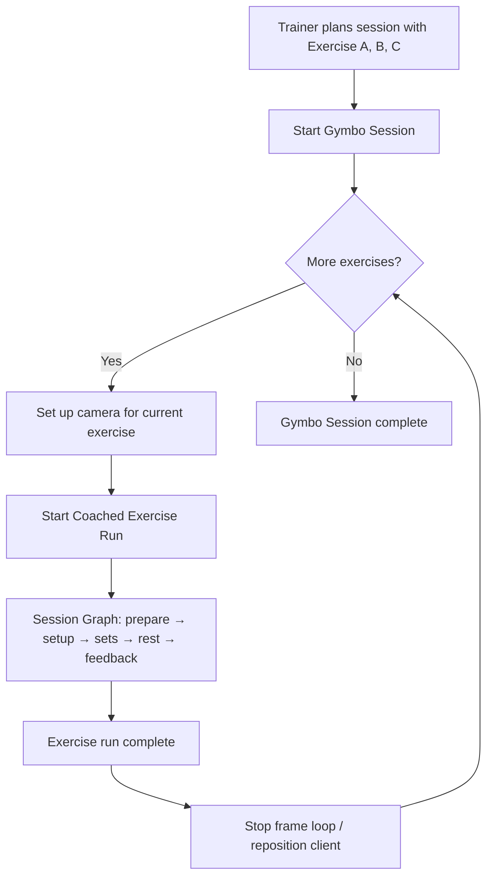
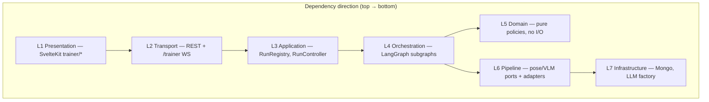
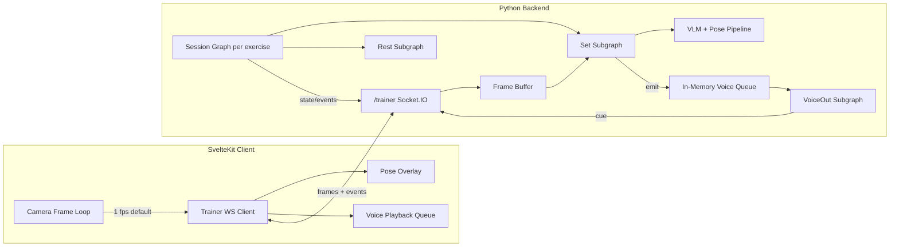
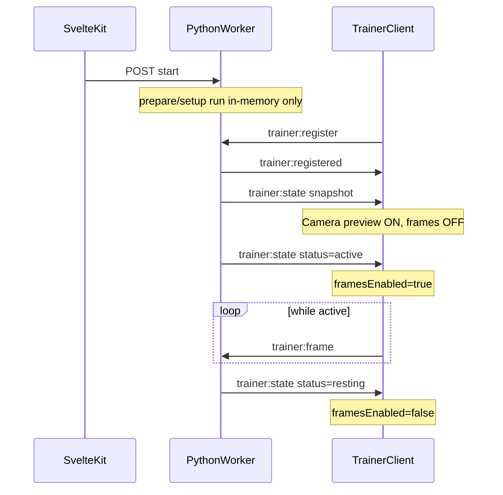

# Implementation Plan: AI Live Trainer Agent

**Branch**: `001-ai-trainer-agent` | **Date**: 2026-06-20 | **Spec**: [spec.md](./spec.md)

**Input**: Feature specification from `/specs/001-ai-trainer-agent/spec.md`

## Summary

Build a server-side LangGraph multi-subgraph agent that coaches **one exercise at a time** (starting with overhead squat). Trainers may plan a **multi-exercise Gymbo session** ahead of time—each `SessionExercise` with its own sets, reps, and rest—but the agent graph runs **once per exercise block**: camera up → prepare → setup → all sets (with optional rest) → exercise feedback → done, then the trainer moves to the next planned exercise until the full session is complete.

The **client** owns the camera frame loop (default 1 fps) and streams frames over WebSocket during an active exercise run; the **server** maintains a frame buffer, runs preprocess + pose + VLM form analysis per observation cycle, merges state or emits async voice-out events, and orchestrates prepare → set loop → rest → exercise feedback within that run. Voice coaching is fire-and-forget with repeat-issue deduplication (default threshold 3). Rep completion comes solely from merged VLM observation state—not pose heuristics.

This extends the existing `backend/src/langchain-flow.py` POC (single-graph VLM loop over video files) into a production hybrid runtime integrated with the SvelteKit app and existing FastAPI/Socket.IO infrastructure.

## Technical Context

**Language/Version**: Python 3.12 (backend), TypeScript/Svelte 5 (frontend via SvelteKit)

**Primary Dependencies**:
- Backend: LangGraph ≥1.2, LangChain OpenAI (OpenRouter), FastAPI, python-socketio, OpenCV, MediaPipe, Pydantic v2, MongoDB (session persistence); in-process `asyncio.Queue` per session for voice-out events
- Frontend: SvelteKit, TailwindCSS, bun, Socket.IO client, existing pose overlay components

**Storage**: MongoDB for coached sessions, coaching events, and session config; in-memory per-session structures (frame buffer, voice-out queue, dedup state) in the single trainer worker process; S3 for optional frame archival (out of v1 scope unless needed for replay)

**Testing**: pytest + pytest-asyncio (backend); bun test / vitest (frontend unit); integration tests with `--dry-run` LangGraph mode and recorded frame fixtures

**Target Platform**: Linux server (RunPod/Docker for GPU inference workers); mobile browser client (trainer supervising via phone camera)

**Project Type**: Web application (SvelteKit frontend + Python backend services)

**Performance Goals**:
- First preparation/setup guidance ≤10 s after session start (SC-001)
- Voice-out cue delivery ≤3 s after event consumption (SC-002)
- Emergency stop within 2 s of unsafe detection (SC-004)
- Set observation loop never blocks on voice playback (SC-007)
- Default 1 fps client sampling; server processes latest frame only

**Constraints**:
- Entire agent graph runs server-side (FR-013)
- Client default frame rate 1 fps (FR-011)
- Voice repeat threshold default 3 (FR-038)
- Rep count from VLM merged state only (FR-022)
- Global emergency stop pauses session; trainer must resume or end (FR-008, FR-009)
- Constitution: SvelteKit + Tailwind + bun frontend; follow ARCHITECTURE.md

**Scale/Scope**: v1 overhead squat as first coached exercise type; one athlete per camera run; trainer-supervised mobile camera; per-exercise set/rep/rest from planned `SessionExercise`; multi-exercise session UX loops exercise runs sequentially; extends existing Gymbo session planning UX (`Session.exercises[]`)

## Constitution Check

*GATE: Must pass before Phase 0 research. Re-check after Phase 1 design.*

| Principle | Gate | Status |
|-----------|------|--------|
| I. Principle Awareness | Plan references and complies with all constitution principles | ☑ |
| II. Follow Instructions | Scope matches spec/user input; no invented requirements | ☑ |
| III. No Assumptions | All ambiguities flagged as NEEDS CLARIFICATION or resolved | ☑ |
| IV. KISS | Simplest viable approach chosen; complexity justified if not | ☑ |
| V. DRY | Reuses existing modules; new shared code identified upfront | ☑ |
| VI. YAGNI | Only user-requested scope; no speculative features | ☑ |
| VII. Modularize | Components split into small, reusable parts | ☑ |
| VIII. Visual Communication | Architecture/flows documented with mermaid where helpful | ☑ |
| IX. Change Logging | Feature `log.md` path identified; logging steps in tasks | ☑ |

**Change log path**: `specs/001-ai-trainer-agent/log.md` (create on first implementation task per Principle IX)

**Violations requiring exceptions**: None. Four LangGraph subgraphs are required by spec; justified in [research.md](./research.md).

### Post-Design Re-Check (Phase 1 + modular decomposition)

All gates pass. Layered module split satisfies Principle VII (Modularize): graphs orchestrate, domain holds rules, pipeline holds perception, transport holds wire formats. No constitution exceptions needed.

## Project Structure

### Documentation (this feature)

```text
specs/001-ai-trainer-agent/
├── plan.md              # This file
├── modular-architecture.md  # Module decomposition (layers, ports, file tree)
├── research.md          # Phase 0 — technology decisions
├── data-model.md        # Phase 1 — entities and state
├── quickstart.md        # Phase 1 — local dev and smoke test
├── contracts/           # Phase 1 — WebSocket + REST contracts
│   ├── trainer-ws.md
│   └── trainer-rest.md
├── checklists/
│   └── requirements.md
└── tasks.md             # Phase 2 (/speckit-tasks — not created here)
```

### Source Code (repository root)

```text
backend/
├── src/
│   ├── agent/
│   │   ├── app/                  # L3 — RunRegistry, RunController, RunContext
│   │   ├── domain/               # L5 — merger, dedup, safety, rep completion
│   │   ├── pipeline/             # L6 — frame buffer, pose/VLM/cue ports + adapters
│   │   ├── graphs/               # L4 — session, set_loop, voice_out, rest
│   │   ├── exercises/            # Exercise profiles (prompts, issue taxonomy)
│   │   ├── infra/                # L7 — Mongo repo, LLM factory, clock
│   │   └── nodes/                # Thin graph node wrappers (optional split)
│   ├── langchain-flow.py         # EXISTING POC → migrate into agent/
│   ├── trainer_socket_namespace.py
│   ├── trainer_fastapi_main.py
│   ├── models/trainer_ws_protocol.py
│   ├── estimator/                # REUSED by pipeline/pose adapter
│   └── database/mongodb/
└── tests/
    ├── unit/agent/domain/
    ├── unit/agent/pipeline/
    └── integration/trainer/

app/src/lib/trainer/               # L1 — see modular-architecture.md
├── exercise-run-flow.ts
├── frame-loop.ts
├── trainer-client.ts
├── voice-playback.ts
└── live-state.svelte.ts
```

**Structure Decision**: Layered modules under `backend/src/agent/` per [modular-architecture.md](./modular-architecture.md). LangGraph graphs are thin orchestrators; business rules live in `domain/`; perception in `pipeline/` behind ports. Frontend `app/src/lib/trainer/` mirrors transport-only responsibilities.

## Multi-Exercise Session vs Single-Exercise Graph

Trainers plan a full workout in Gymbo before or during the visit. A **Gymbo Session** (`Session.exercises[]`) may contain multiple exercises, each with its own `target_sets`, `target_reps`, `rest_seconds`, and `exercise_key`. The AI trainer agent graph does **not** orchestrate the entire multi-exercise workout in one continuous run—it processes **one exercise at a time**.

| Concept | Scope | Owned by |
|---------|-------|----------|
| **Gymbo Session** | Full workout plan (N exercises) | Existing session API / MongoDB |
| **SessionExercise** | One planned exercise block (sets, reps, rest) | `Session.exercises[]` |
| **Coached Exercise Run** | One live agent graph invocation for one `SessionExercise` | Trainer agent (`/trainer` WS) |
| **Session Graph** (LangGraph) | Orchestrator inside a Coached Exercise Run | `backend/src/agent/graphs/session.py` |

### UX flow (multi-exercise session)



**Per exercise run**, the trainer:
1. Positions the camera for that movement (angle/equipment may differ per exercise).
2. Starts live coaching for that `SessionExercise` only.
3. Monitors until all planned sets and reps for **that exercise** are done.
4. Receives per-exercise feedback from the agent.
5. Moves to the next exercise in the session plan (or ends the Gymbo session).

The frame loop and WebSocket connection are scoped to the active Coached Exercise Run. Starting the next exercise starts a new run (new graph state, reset observation merge, fresh voice dedup for that block). The Gymbo Session tracks progress across exercises (which blocks are complete, session-level notes).

**v1 note**: Cardio/duration-based exercises in the plan are out of scope for the rep-observation graph; live agent v1 targets rep-based strength blocks (e.g. overhead squat).

## Control Plane: SvelteKit REST ↔ Python Worker

LangGraph and `RunController` run in the Python trainer worker (`trainer_fastapi_main.py`). SvelteKit owns authenticated REST and MongoDB persistence. Graph lifecycle commands cross process boundaries via an internal HTTP API on the worker.

```mermaid
flowchart LR
    Browser -->|REST cookie auth| SK["SvelteKit /api/trainer/*"]
    Browser -->|WS frames + events| PY["Python /trainer Socket.IO"]
    SK -->|MongoDB CRUD| DB[(MongoDB)]
    SK -->|POST /internal/runs/*/start|resume|end| PY
    PY -->|RunController| Graph[LangGraph subgraphs]
    Graph -->|trainer:* events| Browser
```

| Responsibility | Owner | Endpoint |
|----------------|-------|----------|
| Create run, read snapshot, config patch, event logs | SvelteKit | `/api/trainer/exercise-runs/*` |
| Start / resume / end / pause graph | Python worker (called by SvelteKit server) | `POST /internal/runs/{run_id}/start` etc. |
| Live frames, state, cues, emergency | Python worker | Socket.IO `/trainer` |

**Env**: `TRAINER_WORKER_URL` (default `http://localhost:10001`) on SvelteKit server; `TRAINER_WS_PORT` on Python worker.

## Modular Architecture

Full decomposition: **[modular-architecture.md](./modular-architecture.md)**.

Seven layers with strict dependency direction (presentation → transport → application → orchestration → domain/pipeline → infrastructure):



| Layer | Key modules | Rule |
|-------|-------------|------|
| **L1 Presentation** | `frame-loop`, `trainer-client`, `voice-playback`, `exercise-run-flow` | No coaching logic; multi-exercise UX only |
| **L2 Transport** | `trainer_socket_namespace`, `trainer_ws_protocol`, REST routes | Validate wire format; delegate to L3 |
| **L3 Application** | `RunRegistry`, `RunController`, `RunContext`, `RunEventPublisher` | One `RunContext` per Coached Exercise Run |
| **L4 Orchestration** | `graphs/session`, `set_loop`, `voice_out`, `rest` | Nodes orchestrate; call L5/L6 only |
| **L5 Domain** | `observation_merger`, `voice_dedup`, `rep_completion`, `safety_evaluator` | Pure functions; unit-testable |
| **L6 Pipeline** | `FrameBuffer`, `PosePort`, `VLMPort`, `CueGeneratorPort` | Adapters wrap POC + MediaPipe |
| **L7 Infrastructure** | `RunRepository`, `LLMClientFactory` | External I/O |

**Exercise plugins** (`agent/exercises/`) isolate per-movement VLM prompts—adding an exercise does not change graph structure.

**POC migration**: `langchain-flow.py` splits into domain + pipeline + graphs; CLI retained for offline video dev.

## Architecture



## Implementation Phases (for tasks.md)

| Phase | Scope | Modules (see modular-architecture.md) |
|-------|-------|--------------------------------------|
| P1 | Set Subgraph + frame ingest | `pipeline/*`, `domain/merger`, `graphs/set_loop`, transport frame ingest |
| P2 | VoiceOut Subgraph | `domain/voice_dedup`, `pipeline/cue_generator`, `graphs/voice_out` |
| P3 | Session Graph shell | `graphs/session`, `exercises/overhead_squat`, `app/run_controller` |
| P4 | Safety + emergency | `domain/safety_evaluator`, graph interrupts, pause/resume |
| P5 | Rest Subgraph | `graphs/rest`, `infra/clock` |
| P6 | Exercise run close + feedback | `domain/exercise_feedback`, `infra/run_repository` |
| P7 | Frontend live UI | `app/src/lib/trainer/*`, `live/+page.svelte`, `exercise-run-flow` |

## Complexity Tracking

> No constitution violations. Four subgraphs are spec-mandated orchestration boundaries, not speculative abstraction.

| Decision | Why Needed | Simpler Alternative Rejected Because |
|-----------|------------|-------------------------------------|
| LangGraph subgraphs (4) | Spec defines Session, Set, VoiceOut, Rest as independent coordinated flows | Single linear graph cannot model async voice-out without blocking set loop (violates FR-024, SC-007) |
| Dedicated `/trainer` WS namespace | Separates live agent protocol from existing `/yolo` inference | Overloading YOLO protocol couples unrelated concerns and complicates event routing |
| In-memory voice queue (`asyncio.Queue`) | Decouples set loop from voice consumer within single worker | Synchronous voice generation in set loop would block observation (violates FR-024, SC-007). Redis deferred until multi-worker split |
| SvelteKit + Python split control plane | REST/auth/Mongo in SvelteKit; LangGraph in Python worker | Monolithic Python REST duplicates existing Gymbo auth/session patterns; monolithic SvelteKit graph cannot run LangGraph/MediaPipe stack |
| Live pose overlay deferred | Plan mentions overlay reuse; v1 focuses on coaching loop | Overlay is display-only; server pose drives VLM context, not client overlay (YAGNI for v1 UI) |

---

## Iteration 2: Live transport lifecycle (post-MVP fix)

**Date**: 2026-06-20 | **Trigger**: Live testing — frames sent before `active`; UI/REST status stuck on `preparing`

### Problem summary

| Bug | Root cause | Symptom |
|-----|------------|---------|
| Frames during prepare/setup | Client starts `FrameLoop` immediately after `POST .../start`; server accepts `PREPARING`/`SETUP` | Frame buffer fills before set loop; wasted bandwidth |
| Status stuck on `preparing` | (1) Session graph starts before WS `register`; (2) `publish_state` no-ops when `ctx.sid` is null; (3) `register` emits only `trainer:registered`, no state snapshot; (4) SvelteKit patches Mongo to `preparing` but Python does not persist mid-run transitions | Live UI stale; REST/DB frozen at `preparing` |

### Target behavior



| Run status | Local camera preview | Send `trainer:frame` | Server accept frames |
|------------|---------------------|----------------------|----------------------|
| `preparing` | Yes (framing) | **No** | **No** (silent drop) |
| `setup` | Yes | **No** | **No** |
| `active` | Yes | **Yes** | **Yes** |
| `resting` | Yes | **No** | **No** |
| `paused` | Yes | **No** | **No** |
| `feedback` / `ended` | Stop loop | **No** | **No** |

### Design decisions

| Decision | Rationale | Alternative rejected |
|----------|-----------|---------------------|
| Client gates `sendFrame` on `status === 'active'` | Aligns with FR-011/FR-013 intent; camera preview independent of send | Stop camera during prepare — loses framing UX for prep message |
| Server accepts frames only when `ACTIVE` | Defense in depth; silent drop (no error spam) | Error on every frame during prepare |
| `publish_state` immediately after `trainer:register` | Resync client after startup race | Require WS connect before `POST start` — bigger UX/API reorder |
| Python persists status on each transition | REST/DB matches worker; fixes Mongo stuck at `preparing` | Remove SvelteKit `preparing` patch only — still stale mid-run |
| Wire `trainer:phase_message` to live UI | Phase guidance visible during prepare/setup | Rely on `trainer:state` phase only |

### Constitution check (iteration 2)

| Principle | Gate | Status |
|-----------|------|--------|
| IV. KISS | Minimal diff: gate + snapshot + persist | Pass |
| VI. YAGNI | No WS-before-start reorder in v1 | Pass |
| VII. Modularize | Changes in transport + client only | Pass |
| IX. Change Logging | `log.md` entry on implement | Pass |

### Implementation scope (→ tasks.md Phase 9)

| Module | Change |
|--------|--------|
| `app/src/lib/trainer/trainer-client.ts` | Track `runStatus`; gate `sendFrame`; optional `framesEnabled` callback |
| `backend/src/trainer_socket_namespace.py` | `ACTIVE`-only frame accept; `publish_state` after register |
| `backend/src/agent/graphs/session.py` | `repository.update_run` on status/phase transitions |
| `app/src/routes/api/trainer/exercise-runs/[run_id]/start/+server.ts` | Stop hardcoding Mongo `preparing` before worker confirms (or mirror worker status) |
| `app/src/lib/trainer/exercise-run-flow.ts` | Wire `onPhaseMessage` to live state |
| `contracts/trainer-ws.md` | Document active-only frame rule + register state snapshot |
| `quickstart.md` | Test: no frames during prepare; state updates after register |

### Out of scope (iteration 2)

- Reorder API to connect WS before start
- LangGraph migration
- Periodic `trainer:state` heartbeat when idle in prepare/setup
