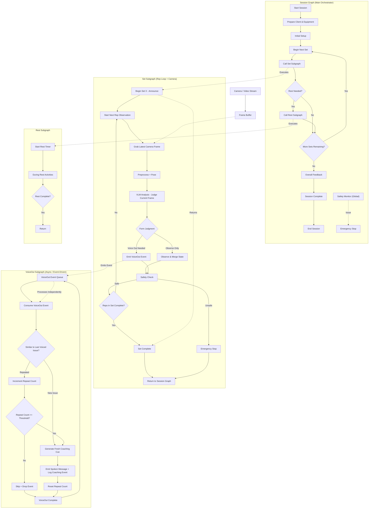

# Feature Specification: AI Live Trainer Agent

**Feature Branch**: `001-ai-trainer-agent`

**Created**: 2026-06-20

**Status**: Draft

**Input**: User description: "AI trainer agent using vision-based form analysis, pose detection, and a multi-subgraph agent orchestrator. Live real-time coaching for one exercise per session with multiple sets. Session Graph orchestrates prepare → setup → set loop → optional rest → feedback → session complete. Set Subgraph runs a per-frame rep loop: grab camera frame → preprocess and pose → vision analysis → observe or emit VoiceOut event → safety check. VoiceOut Subgraph consumes events asynchronously with repeat-issue deduplication before spoken cues. Rest Subgraph manages rest timer and activities. Global safety monitor can trigger emergency stop."

## Session Flow Overview

The coached session is orchestrated as four coordinated subgraphs on the **server**: Session Graph (main orchestrator), Set Subgraph (rep loop + camera pipeline), VoiceOut Subgraph (async event-driven spoken cues), and Rest Subgraph. The **client** owns the frame loop—sampling the live camera at a configurable rate (default 1 frame per second) and sending frames to the server. The server runs the entire agent graph; voice-out events are fire-and-forget from the set loop and processed independently so observation is not blocked by cue generation or playback.

### Flow notes

- **Set loop**: Each observation cycle grabs the latest frame from the buffer, derives pose data, and runs vision-based form analysis on the current frame. The judgment is either observe-only (merge into session state) or voice-out-needed (emit an event with focus issue, reason, and severity). Both paths continue to safety check before the next observation or set completion.
- **VoiceOut loop**: Runs independently of the set loop. Repeated issues are suppressed until a repeat threshold is met, then a fresh cue is generated, spoken, and logged. The set loop does not wait for voice playback to finish.
- **Session loop**: After each set returns, the orchestrator decides whether rest is needed, then whether more sets remain, before overall feedback and session complete.
- **Safety**: Global safety monitor can trigger emergency stop from any phase. Set-level unsafe safety check returns emergency to session orchestration. Global emergency stop pauses all coaching until the trainer resumes or ends the session.
- **Client / server split**: Client captures and samples frames; server receives frames and runs all subgraphs including preprocess, pose, vision analysis, and orchestration.
- **Rep completion**: Rep count and set completion are determined solely from merged vision-analysis observation state—not from independent pose-based rep heuristics.

## Clarifications

### Session 2026-06-20

- Q: Where should the live agent orchestrator run during an active coached session? → A: Hybrid — client owns the frame loop (configurable sampling rate, default 1 fps); entire agent graph runs server-side.
- Q: How should rep completion be determined for "reps in set complete?" → A: Vision analysis only — rep completion from merged observation state / form analysis.
- Q: When a new voice-out cue is ready while the previous cue is still playing, what should happen? → A: Skip or queue — skip duplicates per dedup rules; queue new issues and threshold-met repeats.
- Q: What is the default voice-out repeat threshold? → A: 3 — speak on the third similar event.
- Q: After global safety monitor triggers emergency stop, what should the session do? → A: Pause — halt all coaching; trainer explicitly resumes or ends session.

## User Scenarios & Testing *(mandatory)*

### User Story 1 - Live Set Coaching (Priority: P1)

A trainer supervises a client performing one exercise during a live camera session. For each observation cycle in a set, the system grabs the latest camera frame, derives pose data, runs vision-based form analysis, merges observations into session state or emits a voice-out event when coaching is needed, performs a safety check, and continues until the set's target reps are complete.

**Why this priority**: This is the core value—continuous frame-based observation, rep tracking, and coaching triggers during a single set.

**Independent Test**: Run one set with a live camera feed. Verify frame pipeline runs, state merges on observe-only cycles, voice-out events emit when form issues need coaching, rep completion is detected, and set returns to session orchestration.

**Acceptance Scenarios**:

1. **Given** a session is active with target reps announced, **When** the set subgraph runs an observation cycle, **Then** the system grabs the latest frame from the camera buffer, preprocesses it, and derives pose data before form analysis.
2. **Given** form analysis judges the current frame as observe-only, **When** the cycle completes, **Then** the system merges observations into session state without emitting a voice-out event.
3. **Given** form analysis judges voice-out is needed, **When** the cycle completes, **Then** the system emits a voice-out event (focus issue, reason, severity) and continues the set loop without waiting for spoken playback.
4. **Given** a set is in progress, **When** merged vision-analysis state records the target number of completed reps, **Then** the set subgraph returns set-complete status to session orchestration.

---

### User Story 2 - Async Voice Coaching (Priority: P1)

When the set loop emits a voice-out event, an independent voice subgraph consumes the event, deduplicates repeated issues, generates a fresh coaching cue when appropriate, speaks the message, and logs a coaching event—without blocking the set observation loop.

**Why this priority**: Spoken coaching is the primary delivery channel and must not stall live frame analysis. Deduplication prevents cue spam for the same recurring fault.

**Independent Test**: Trigger multiple voice-out events for the same issue during a set. Verify first occurrence may be skipped until repeat threshold, fresh issues get cues immediately, spoken messages are logged, and set loop continues in parallel.

**Acceptance Scenarios**:

1. **Given** a voice-out event for a new issue, **When** the voice subgraph consumes it, **Then** the system generates a fresh coaching cue, speaks it, and logs a coaching event.
2. **Given** a voice-out event similar to the last voiced issue, **When** repeat count is below threshold, **Then** the system skips and drops the event without speaking.
3. **Given** repeated similar voice-out events, **When** repeat count reaches the configured threshold (default 3), **Then** the system generates and speaks a fresh cue and resets the repeat count.
4. **Given** the set loop is actively observing, **When** voice-out events are processed, **Then** frame observation continues without waiting for cue generation or playback to finish.
5. **Given** a cue is still playing on the client, **When** a duplicate issue below repeat threshold is consumed, **Then** the system skips without interrupting playback; **When** a new issue or threshold-met repeat is ready, **Then** the cue is queued for playback after the current cue finishes.

---

### User Story 3 - Safety and Emergency Stop (Priority: P2)

During any phase of a coached session, the system continuously monitors for unsafe movement or signs of pain. When a critical safety issue is detected, the system halts further rep coaching and guides the session toward a safe cool-down.

**Why this priority**: Safety failures undermine trust and can cause injury. Emergency stop must work independently of set or rest logic.

**Independent Test**: Simulate an unsafe safety check or global safety trigger during an active set. Verify emergency stop, halted set observation, and session-complete messaging when the session ends.

**Acceptance Scenarios**:

1. **Given** a set observation cycle completes, **When** the safety check finds an unsafe condition, **Then** the set subgraph triggers emergency stop and returns to session orchestration within 2 seconds.
2. **Given** the global safety monitor detects an issue during any phase, **When** emergency stop is triggered, **Then** the system pauses all coaching and waits for the trainer to explicitly resume or end the session.
3. **Given** emergency stop has paused the session, **When** the trainer ends the session, **Then** the athlete receives clear session-complete messaging.
4. **Given** emergency stop has paused the session, **When** the trainer resumes, **Then** coaching continues from the paused state without auto-skipping to session complete.

---

### User Story 4 - Rest Between Sets (Priority: P3)

After completing a set when more sets remain and rest is needed, the system runs the rest subgraph: start rest timer, run during-rest activities, and return to session orchestration when rest is complete.

**Why this priority**: Rest separates sets in a multi-set session and can be built after core set and voice coaching work.

**Independent Test**: Complete one set, invoke rest subgraph, verify timer starts, during-rest activities run, and return to session when rest completes or trainer ends rest early.

**Acceptance Scenarios**:

1. **Given** a set is complete and rest is needed, **When** the rest subgraph starts, **Then** the system starts a rest timer.
2. **Given** rest is in progress, **When** the timer has not elapsed, **Then** the system runs during-rest activities without restarting the next set.
3. **Given** rest is complete or the trainer ends rest early, **When** the rest subgraph returns, **Then** session orchestration proceeds to the more-sets decision or next set.

---

### User Story 5 - Session Open and Close (Priority: P4)

A trainer starts a coached session for a single exercise. The system prepares the client and equipment, runs initial setup, orchestrates all sets (with optional rest), delivers overall feedback, and marks the session complete.

**Why this priority**: Full session orchestration wraps set, voice, and rest experiences into a complete coaching journey.

**Independent Test**: Run a full single-exercise session from start through all planned sets to session end. Verify preparation, initial setup, per-set announcements, overall feedback, and session complete messaging.

**Acceptance Scenarios**:

1. **Given** a trainer starts a new coached session, **When** the session opens, **Then** the athlete receives preparation guidance for client readiness and equipment within 10 seconds.
2. **Given** preparation is complete, **When** initial setup runs, **Then** the system validates readiness before the first set begins.
3. **Given** all planned sets are complete, **When** the session ends normally, **Then** the athlete receives overall feedback covering total reps, recurring issues, improvements observed, and one focus for next time.
4. **Given** the session ends (normally or via emergency stop), **When** session complete runs, **Then** the athlete receives clear end-of-session messaging.

---

### Edge Cases

- Camera stream stalls or frame buffer is empty—set loop skips or retries observation without crashing; no stale cues from outdated frames.
- Pose data unavailable after preprocess—observe-only path records low confidence; voice-out only when analysis confidence meets minimum threshold.
- Voice-out event queue grows faster than consumption—events are dropped or coalesced rather than blocking the set loop or flooding playback.
- Same issue repeats below voice threshold—events are skipped and dropped; athlete is not spammed with duplicate cues.
- Same issue repeats above threshold—fresh cue is generated even if phrasing differs from prior cue.
- Cue still playing when next voice-out is processed—duplicate issues below threshold are skipped; new issues and threshold-met repeats are queued and play after the current cue without interrupting it.
- Only one camera angle available—system continues using the live stream; no multi-angle requirement blocks the session.
- Athlete pauses mid-set—observation cycles continue; rep completion logic does not treat pause as rest between sets.
- Athlete exceeds target reps or stops early—trainer can end the set; set-complete reflects actual completed reps.
- Rest timer not yet complete—during-rest activities continue until rest complete or trainer ends rest early.
- Multiple people in frame—system coaches primary athlete or prompts clarification when identity is ambiguous.
- Network or processing interruption—trainer is notified; server pauses observation processing rather than delivering stale analysis.
- Client frame rate changed mid-set—server adapts to incoming frame cadence without resetting merged observation state.
- Frame delivery lag from client—server uses latest received frame; does not block set loop on client playback.
- Global emergency stop pauses session—trainer must resume or end; session does not auto-complete.

## Requirements *(mandatory)*

### Functional Requirements

**Session orchestration**

- **FR-001**: System MUST guide client and equipment preparation before any movement begins in a coached session.
- **FR-002**: System MUST run initial setup before the first set of the session.
- **FR-003**: System MUST announce the set at the start of each set (including target reps).
- **FR-004**: System MUST call the set subgraph for each set and decide whether rest is needed before checking for more sets.
- **FR-005**: System MUST call the rest subgraph when rest is needed and more sets remain.
- **FR-006**: System MUST deliver overall feedback after all planned sets are complete.
- **FR-007**: System MUST mark the session complete and end the session after overall feedback, or when the trainer ends the session after emergency stop pause.
- **FR-008**: When global safety monitor triggers emergency stop, system MUST pause all coaching and MUST NOT auto-end the session or skip to session complete until the trainer resumes or ends the session.
- **FR-009**: Trainer MUST be able to resume or end a session after global emergency stop pause.

**Client frame loop**

- **FR-010**: Client MUST sample the live camera stream in a frame loop at a configurable rate.
- **FR-011**: Client frame loop default sampling rate MUST be 1 frame per second (half of 2 fps).
- **FR-012**: Client MUST send sampled frames to the server for agent processing.

**Server agent graph**

- **FR-013**: Entire agent graph (session, set, voice-out, rest subgraphs) MUST run server-side.
- **FR-014**: Server MUST maintain a frame buffer fed by frames received from the client.
- **FR-015**: Each server observation cycle MUST process the latest frame received from the client frame buffer.
- **FR-016**: Server MUST preprocess each frame and derive pose data before form analysis.
- **FR-017**: Server MUST run vision-based form analysis on the current frame and produce a form judgment.
- **FR-018**: When judgment is observe-only, server MUST merge observations into session state without emitting a voice-out event.
- **FR-019**: When judgment requires voice-out, server MUST emit a voice-out event containing focus issue, reason, and severity.
- **FR-020**: After observe or voice-out, server MUST run a safety check before continuing the observation loop or completing the set.
- **FR-021**: When safety check is unsafe, set subgraph MUST trigger emergency stop and return to session orchestration.
- **FR-022**: Rep completion and completed-rep count MUST be determined solely from merged vision-analysis observation state—not from independent pose-based rep heuristics.
- **FR-023**: When merged observation state records target reps complete for the set, set subgraph MUST return set-complete status to session orchestration.
- **FR-024**: Set observation loop MUST continue without waiting for voice-out cue generation or spoken playback.

**VoiceOut subgraph (async / event-driven)**

- **FR-025**: Server MUST consume voice-out events from a queue independently of the set observation loop.
- **FR-026**: For each consumed event, server MUST compare the focus issue to the last voiced issue.
- **FR-027**: When the issue is new, server MUST generate a fresh coaching cue, deliver spoken output to the client, and log a coaching event.
- **FR-028**: When the issue is similar to the last voiced issue, server MUST increment a repeat count; if below threshold, skip and drop the event without speaking.
- **FR-029**: When repeat count reaches threshold, server MUST generate a fresh coaching cue, deliver spoken output, log a coaching event, and reset the repeat count.
- **FR-030**: Voice subgraph MUST return to consuming the next queued event after each event is processed (skip or speak).
- **FR-031**: When a cue is already playing, server MUST skip duplicate issues below repeat threshold without interrupting playback.
- **FR-032**: When a cue is already playing and the issue is new or repeat threshold is met, server MUST queue the cue for playback after the current cue finishes—without interrupting the playing cue.

**Rest between sets**

- **FR-033**: Server MUST start a rest timer when the rest subgraph is invoked.
- **FR-034**: During rest, server MUST run during-rest activities (e.g. reinforce cues, mobility tips, recovery check).
- **FR-035**: When rest is complete, rest subgraph MUST return to session orchestration.

**Cross-cutting**

- **FR-036**: Global safety monitor MUST be able to trigger emergency stop from any session phase.
- **FR-037**: Trainer MUST be able to configure planned set count, target reps per set, and rest duration before or at session start.
- **FR-038**: Trainer MUST be able to configure the voice-out repeat threshold for similar issues; default threshold MUST be 3 similar events before speaking.
- **FR-039**: Trainer MUST be able to configure client frame sampling rate before or during session start.

### Key Entities

- **Coached Session**: A single-exercise live coaching session; includes exercise identity, planned sets and reps, rest configuration, merged observation state, status (preparing, active, resting, paused, ended, emergency), and timestamps.
- **Client Frame Loop**: Client-side sampling of the live camera; configurable rate (default 1 fps); sends frames to server.
- **Frame Buffer**: Server-side buffer of latest frames received from the client; consumed by the set observation loop.
- **Observation Cycle**: One grab-preprocess-analyze-merge-or-emit pass within the set loop; includes frame reference, pose data, form judgment, and safety outcome.
- **Set**: One round of reps within a session; includes set number, target reps, completed reps, and completion status returned to session orchestration.
- **VoiceOut Event**: Coaching trigger emitted by the set loop; includes focus issue, reason, severity, and timestamp. Fire-and-forget to the voice queue.
- **VoiceOut Queue**: Server-side async event queue between set subgraph and voice subgraph; events are consumed independently.
- **Voice Playback Queue**: Client-side queue of spoken cues awaiting playback; new and threshold-met cues are appended; duplicates below threshold are not enqueued.
- **Coaching Event**: Logged spoken output; includes message, focus issue, trigger reason, severity, and timestamp.
- **Voice Repeat State**: Tracks last voiced issue and repeat count for deduplication; default speak threshold is 3 similar events.
- **Rest Period**: A break between sets; includes timer state, during-rest activities, and completion status.
- **Safety Event**: Safety trigger from set-level check or global monitor; includes severity, trigger description, and whether session was halted.

## Success Criteria *(mandatory)*

### Measurable Outcomes

- **SC-001**: Athletes receive the first preparation or setup guidance within 10 seconds of session start.
- **SC-002**: Voice-out events for new issues result in spoken cues within 3 seconds of event consumption.
- **SC-003**: Rep count from merged vision-analysis state matches trainer manual count in at least 90% of test sets across a representative sample of overhead squat sessions.
- **SC-004**: Set-level or global emergency stop halts further set observation within 2 seconds of an unsafe safety check or global safety trigger.
- **SC-005**: Overall feedback at session end includes total reps completed, top recurring issues, at least one observed improvement, and one next-session focus.
- **SC-006**: Similar voice-out events below the repeat threshold (default 3) are dropped at least 90% of the time without spoken output.
- **SC-007**: Set observation cycles continue without blocking on voice playback in 100% of test runs where voice-out events are emitted.
- **SC-008**: Trainers can complete a full single-exercise session (3 sets with rest) without manual intervention beyond starting the session and configuring the plan.

## Assumptions

- Live real-time coaching during an active camera session is the delivery mode for v1 — confirmed by stakeholder.
- One exercise per coached session with multiple sets and optional rest between sets — confirmed by stakeholder.
- Primary persona is a trainer supervising a client via mobile camera — per product direction.
- Starting exercise family is squat/overhead squat — per existing product focus.
- Hybrid runtime: client owns frame loop (default 1 fps sampling); entire agent graph runs server-side — confirmed in clarification session 2026-06-20.
- Rep completion is determined solely from merged vision-analysis observation state, not pose-based rep heuristics — confirmed in clarification session 2026-06-20.
- Vision-based form assessment and pose derivation from received frames are server-side inputs to the set loop — per stakeholder input.
- Voice-out is fire-and-forget from the set loop; spoken cues are produced asynchronously by the server voice subgraph — per updated flow diagram.
- Default voice-out repeat threshold is 3 similar events before speaking — confirmed in clarification session 2026-06-20.
- Global emergency stop pauses coaching; trainer must resume or end session (no auto-end) — confirmed in clarification session 2026-06-20.
- Voice-out overlapping playback: skip duplicates below threshold; queue new and threshold-met cues without interrupting current playback — confirmed in clarification session 2026-06-20.
- Trainer configures planned sets, target reps, rest duration, frame sampling rate, and voice repeat threshold before or at session start — default unless auto-planning is requested later.
